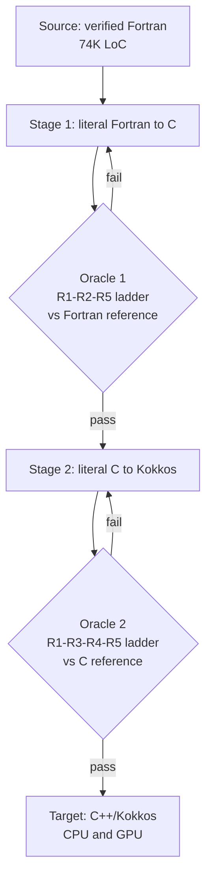

# Staged Literal Porting with a Per-Stage Numeric Oracle

> Stage an LLM port one axis at a time, ban improvements, and gate every stage on a numeric oracle drawn from the prior version.

Koldunov et al. ported ~74,000 lines of core FESOM2 Fortran first to C and then to C++/Kokkos using Claude Code on Claude Opus 4.7 in auto-accept mode, with a domain expert directing strategy and reviewing diffs ([arXiv:2606.11356](https://arxiv.org/abs/2606.11356)). Their first attempt silently broke physics — the discipline below is what made the second attempt work. It couples three rules: stage the port so each step changes one axis at a time, require strictly literal translation per stage so any divergence is a port bug by definition, and tie every stage to an oracle that runs the prior version end-to-end.

## The silent-drift problem

LLM-assisted code translation produces output that compiles and runs but silently violates source semantics. The 2023 "Lost in Translation" survey of LLM-translated code catalogs six recurring bug classes — semantic errors, logic errors, API mistranslations, syntax errors, data-handling errors, and missing-functionality errors — across multiple language pairs ([arXiv:2308.03109](https://arxiv.org/abs/2308.03109)). For Fortran specifically, sparse training data and complex domain semantics make single-pass translation unreliable, and dual-agent and multi-turn dialogue approaches are needed to recover correctness ([Fortran2CPP — arXiv:2412.19770](https://arxiv.org/abs/2412.19770)).

The FESOM2 paper shows the same pattern at production scale. Their first attempt failed because the assistant's accumulated "improvements" — coefficients linearized for "readability," lookup tables replaced with polynomial approximations, geometry-corrupting arithmetic rearrangement — produced a port that compiled, ran, and computed the wrong physics ([arXiv:2606.11356](https://arxiv.org/abs/2606.11356)). The workflow on this page is the discipline that succeeded on the second attempt.

## When this applies

The discipline pays back only when a verified, bit-reproducible reference exists — the source codebase compiles, runs deterministically at the production configuration, and the team can capture its output as the port's acceptance signal. Outside that envelope a single-pass idiomatic translation with property-based tests against a reference implementation is usually cheaper and produces more maintainable target code ([SACTOR — arXiv:2503.12511](https://arxiv.org/abs/2503.12511) takes that shape).

Four more preconditions:

- Thin third-party API surface. Over 60% of LLM code-translation errors come from API mistranslations ([APIRAT — arXiv:2504.14852](https://arxiv.org/abs/2504.14852)) — literal mapping invokes non-existent APIs or omits required ones. The recipe applies to numerical kernels, codecs, parsers, and protocol implementations where the source's library surface is small and target-equivalent.
- A domain expert as director, not reviewer. The FESOM2 paper credits detection of a latent constant bug — an Adams-Bashforth offset coded as 10⁻⁹ instead of 0.1, which destabilized the Arctic only after ~110 simulated days — to the domain expert reading diffs and recognizing physically wrong but syntactically correct output ([arXiv:2606.11356](https://arxiv.org/abs/2606.11356)). A non-expert reviewer cannot make that call.
- Source-target language pair preserves control flow. Fortran→C and C→Kokkos preserve loops, indices, and memory layouts. Fortran→Rust, COBOL→Go, or imperative→functional ports require structural changes literal translation cannot encode — [SACTOR](https://arxiv.org/abs/2503.12511) is the better-fit shape there.
- Fast acceptance loop. The "any divergence is a port bug" rule presumes per-kernel and short whole-model runs fit a normal review cycle. A port whose verification step takes days cannot run the literal-rule loop.

## Why it works

Holding the source as the verified specification converts every behavioral ambiguity into a clear oracle: "Because the Fortran is the verified specification and is stable at the production time step, any divergence of the port from the Fortran's behavior is a port bug by definition. That single rule narrows the debugging search: there is never a question of whether the physics is 'supposed to' behave differently" ([arXiv:2606.11356](https://arxiv.org/abs/2606.11356)). Staging then preserves the property at each step — the C port's oracle is the original Fortran, validated by long-term simulation statistics; the Kokkos port's oracle is the C reference, validated bit-for-bit on CPU and within tight tolerances on GPU. Each stage carries one degree of freedom — numerics, then parallelism — so divergences localize to the stage that introduced them.

The same shape appears in [SACTOR](https://arxiv.org/abs/2503.12511) (C → unidiomatic Rust → idiomatic Rust, with FFI-based end-to-end testing at each stage), confirming the mechanism is not FESOM2-specific. What FESOM2 adds is the strict numeric oracle drawn from production reference output rather than from a test suite, which is what makes the discipline workable for systems whose tests cannot fully pin down behavior.

## Stage boundaries and literal translation (layers 1-2)

### Layer 1: stage boundaries that isolate one axis

Split the port so each stage changes exactly one property. FESOM2 used two: Fortran→C reproduces numerics inside a single intermediate language with broad library compatibility; C→Kokkos introduces performance-portable parallelism without re-litigating numeric choices. The intermediate C stage forces commitment to a single configuration of compile-time switches and defaults, removing an ambiguity axis before parallelism is layered on ([arXiv:2606.11356](https://arxiv.org/abs/2606.11356)).

Carry the same shape to other ports — Fortran→C++ might be staged as Fortran→serial C++ → parallel C++/OpenMP/CUDA. Stage count is not the point; one axis per stage is. Skip the intermediate stage and the assistant has two open questions at once (what does the source do, and how should we parallelize it), and divergences stop localizing ([arXiv:2606.11356](https://arxiv.org/abs/2606.11356)).

### Layer 2: literal translation, enforced at constant granularity

Forbid the assistant from "improving" the source. FESOM2's secondary rule made this enforceable: any constant statement in the port must quote the source `file:line` and the literal value, never a paraphrased or commented-out form ([arXiv:2606.11356](https://arxiv.org/abs/2606.11356)). The paper notes the LLM's "standing tendency to 'simplify' or 'improve' unless repeatedly constrained" — without the constant-granularity rule, the assistant rewrites a lookup table as a polynomial, picks a "more readable" coefficient, or rearranges floating-point arithmetic into a form that breaks bitwise reproducibility.

The rule does not forbid all judgment. The FESOM2 team explicitly authorized deliberate departures — mainly the I/O subsystem, where literal port of Fortran NetCDF idioms produced unmaintainable C. Those exceptions were the domain expert's call, not the assistant's.

## Per-stage oracle and validation ladder (layer 3)

### Layer 3: per-stage oracle with a validation ladder

Define a per-stage acceptance ladder before the port begins. FESOM2's R1–R5 ladder:

| Tier | Scope | Pass standard |
|---|---|---|
| R1 | Per-kernel, Serial/OpenMP | `max\|Δ\| = 0` against the C reference |
| R2 | Whole model Serial | Byte-identical, one simulated year |
| R3 | OpenMP threaded | Bit-identical for maps/gathers; ≲10⁻¹² per step for scatters |
| R4 | GPU mandatory gate | 20-step active-ice run; per-field magnitude ceilings |
| R5 | Multi-year parity | Correlation ≈1, drift ≈0 over 5-year integration |

The C-vs-Fortran tolerances were calibrated against five-year runs (SST RMS 0.006°C, salinity 0.002 PSU, interior below 700m statistically indistinguishable from zero), and GPU bias (+10⁻⁴°C) sits three orders of magnitude below the C-vs-Fortran uncertainty floor ([arXiv:2606.11356](https://arxiv.org/abs/2606.11356)). Calibrating the ladder against the source first means the acceptance signal is a real measurement, not a guess.

Inside each stage, keep the prior version's kernels in source as "twins" — FESOM2 left the original C kernels inline and compared them at runtime against the Kokkos versions via an environment variable (`FESOM_KK_VERIFY`), restoring live model state after the comparison so the verifier did not perturb the run ([arXiv:2606.11356](https://arxiv.org/abs/2606.11356)). The twin mechanism is what makes per-kernel R1 verification tractable on a running model.

Add always-on sanity probes (out-of-range field detection), stale-halo probes (boundary points that never received an exchange), and subsystem disable-switches so the team can bracket divergence to specific kernels without re-running the full ladder for every hypothesis.

## Triggers and constraints

- Trigger — staged ports run kernel by kernel; the assistant proposes a port, the twin verifier runs at next compile, and divergence triggers a fix loop. There is no schedule.
- Bound on agent authority — the assistant translates literally and builds the harness; the domain expert authorizes every departure from literal translation and reviews every diff before it lands ([arXiv:2606.11356](https://arxiv.org/abs/2606.11356)). The assistant may not change a constant or rearrange floating-point arithmetic on its own initiative.
- Out of scope — the recipe does not cover ports where idiomatic refinement is the goal in itself (C→Rust for memory safety, Fortran→Julia to fit Julia's libraries). For those, see SACTOR's two-phase pipeline ([arXiv:2503.12511](https://arxiv.org/abs/2503.12511)) or the [Documentation-Guided Legacy Migration](documentation-guided-legacy-migration.md) workflow.

## Multi-tool coverage

Tool-agnostic in shape. FESOM2 used Claude Code on Claude Opus 4.7 with file-based brainstorming and planning skills ([arXiv:2606.11356](https://arxiv.org/abs/2606.11356)); a closely related fully-autonomous variant on the same Fortran→Kokkos path reports paid OpenAI models (GPT-4 class, o1-class) succeeding where open-source Llama-class models failed to produce functional code ([arXiv:2509.12443](https://arxiv.org/abs/2509.12443)). The shape of the recipe — staged boundaries, literal rule, per-stage oracle — does not depend on the harness; any tool that can run a long-horizon agentic loop against a per-kernel verifier can host it.

## When this backfires

- No bit-reproducible reference output. Stochastic systems, simulations with rng or hardware-dependent timing, and most web applications fail the precondition. "Any divergence is a port bug" collapses without a deterministic source of truth, and the literal rule loses its core role.
- API-heavy source. Ports dominated by library calls (DB drivers, web frameworks, ML training stacks) hit the API-mistranslation wall ([arXiv:2504.14852](https://arxiv.org/abs/2504.14852)). Literal mapping invokes non-existent APIs or omits required ones — the discipline aimed at numeric kernels does not transfer.
- No domain expert in the loop. Without an expert reviewer, the latent-constant class of bug — physically wrong but syntactically valid output — spreads silently. The FESOM2 team caught the Adams-Bashforth 10⁻⁹-vs-0.1 mistranslation only because a director with the model's physics in their head reviewed the diff ([arXiv:2606.11356](https://arxiv.org/abs/2606.11356)). Hand the same diff to a generalist and it lands.
- Cross-paradigm target. Fortran→Rust, COBOL→Go, or imperative→functional ports require non-mechanical structural changes. The literal rule fights the target language's abstractions instead of using them; [SACTOR](https://arxiv.org/abs/2503.12511) is the correct shape there because its second phase explicitly handles idiomatic refinement under static analysis.
- Acceptance loop too slow. The R1–R5 ladder presumes per-kernel checks and short whole-model runs fit in a normal iteration. A port whose verifier takes a week per change cannot use the "literal rule converts every ambiguity into an oracle" mechanism, because the loop never closes.
- Generic "literal translation as default" without staging or oracle. Literal translation alone, without per-stage oracles, reproduces the failure mode the LLM-translation literature already cataloged ([arXiv:2308.03109](https://arxiv.org/abs/2308.03109)). The discipline works only as a triple — staged, literal, oracled — not as one practice alone.

## Example

The FESOM2 port's four enumerated failure classes show what the per-stage oracle and the literal rule were guarding against ([arXiv:2606.11356](https://arxiv.org/abs/2606.11356)):

| Failure class | Concrete instance | Detection mechanism |
|---|---|---|
| Latent constant bug | Adams-Bashforth offset coded as 10⁻⁹ instead of 0.1 — Arctic instability after ~110 model days | R5 multi-year parity drift; domain expert reading diff |
| Halo loop-bound bug | Write loop covered owned-plus-halo in Fortran, only owned in port — stale halos diverge silently and rank-dependently | Stale-halo probe; OpenMP R3 scatter divergence |
| Uncomputed field | Array allocated and exchanged but never computed — sits at zero until a downstream kernel first reads it | Per-substep reference dump + identical-input operator diff |
| Index/stride error | Wrong vertical stride or per-vertex/per-cell geometry mismatch — ~1000× gradient inflation or layer-thickness corruption | R1 `max\|Δ\| ≠ 0`; out-of-range sanity probe |

None of these are syntax errors. All of them compile, run, and produce output. Without the staged, literal, oracled triple, all four classes land silently — exactly the FESOM2 team's first-attempt failure mode.

## Key Takeaways

- The recipe is one practice in three parts — staged boundaries that change one axis at a time, strictly literal translation per stage, and an oracle per stage drawn from the prior version's output. Any one alone produces the failure modes the LLM-translation literature already catalogues.
- The mechanism is bug-oracle compression — holding the source as verified specification converts every behavioural ambiguity into a clear divergence signal, and staging preserves the property at each step.
- The literal rule must be enforceable at constant granularity (quote `file:line` and exact value) or the assistant silently "improves" coefficients and rearranges arithmetic until bitwise reproducibility breaks.
- A per-kernel "twin" of the prior version, gated by an environment variable so the run state is restored after comparison, makes the per-kernel R1 oracle tractable on a running production model.
- Outside the preconditions (bit-reproducible reference, thin API surface, control-flow-preserving language pair, expert director, fast acceptance loop) the recipe inverts — a SACTOR-style two-phase pipeline or a property-based test harness against a single canonical port costs less and produces more maintainable code.

## Related

- [Documentation-Guided Legacy Migration: Architecture Docs as a C-to-Rust Blueprint](documentation-guided-legacy-migration.md) — Alternative shape when no executable reference exists; uses a generated architecture document as the intermediate representation instead of production output.
- [Parallel Polyglot Ports as a Spec-Ambiguity Oracle](parallel-polyglot-ports-spec-oracle.md) — Sibling differential-testing workflow; uses divergence between sibling ports as the oracle, not divergence from a prior canonical version.
- [Spec-Driven Development with Spec Kit](spec-driven-development.md) — The new-code analogue: an executable specification plays the role the verified source plays in this workflow.
- [Verification-Centric Development for AI-Generated Code](verification-centric-development.md) — General layered-verification frame that the R1–R5 acceptance ladder instantiates.
- [The Research-Plan-Implement Pattern](research-plan-implement.md) — Three-phase shape this workflow specialises for staged literal porting.

The composed building blocks (an incremental-verification technique page and a numeric-oracle pattern page) do not yet have standalone entries under `docs/patterns/` or `docs/techniques/` — the closest sibling building blocks today live under [Verification-Centric Development](verification-centric-development.md) and the workflows above. File an idea issue if you would benefit from a standalone "kernel-twin verification" technique page.
