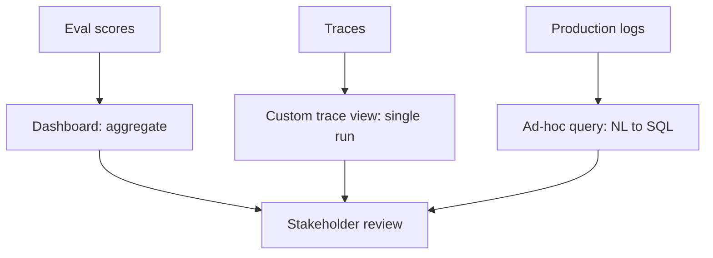

# Stakeholder Trust Through Evals and Observability

> A three-artefact review cycle — dashboard, custom trace view, ad-hoc query — that makes eval and observability data legible to non-engineers without engineering present.

The pattern only earns trust when three preconditions hold: error-analysis narration is already happening, the headline metric is plural rather than a single composite score, and the artefact lives in a surface the audience already opens. Without any of those, the dashboard becomes vanity metrics that destroy trust faster than no artefact at all.

## Why stakeholder-facing evals and observability

Eval scores, traces, and observability data come from structurally different subsystems — offline harness, runtime tracing, infrastructure metrics — each optimized for the engineer who owns it, with legibility to a non-engineer incidental. Stakeholders (PM, leadership, GTM, support leads) cannot judge whether an AI feature is working without pulling those signals onto one surface and re-rendering them in domain vocabulary ([Braintrust: How to earn stakeholder trust with evals and observability, 28 April 2026](https://www.braintrust.dev/blog/stakeholder-trust-evals-observability)). Otherwise engineering gets pulled into status meetings to paraphrase eval scores and trace JSON — a cost that scales poorly as AI features multiply.

## Preconditions

The workflow pays off only when all three are met. Adopting the artefacts beforehand produces theatre — a leadership view reporting a regression nobody can explain in the meeting it surfaces in.

- Error analysis is already a habit. The team reviews real failed traces weekly or per release and produces a written list of top failure modes. "Don't just show dashboards and metrics; tell the story of what you're finding in the data" — the trust transfer is in the narration of error analysis, not the aggregate scores ([Hamel Husain & Shreya Shankar, LLM Evals FAQ, January 2026](https://hamel.dev/blog/posts/evals-faq/)). Without this, the dashboard is read once and then ignored.
- The headline view is plural. A leadership view shows quality, cost, and volume side-by-side, not a single composite "AI quality score." A number promoted to a KPI gets optimized for — Goodhart's law applies. "Every internal AI dashboard, every vendor ROI deck, every quarterly review surfaces the same headline: tokens consumed" hides "premium-model overuse, context stuffing, agent loops, and tokenizer drift" inside one number ([TrueFoundry: Tokenmaxxing](https://www.truefoundry.com/blog/tokenmaxxing-ai-cost-governance)).
- The artefact lives where the audience already works. "The most capable observability AI does nothing for your team if it lives in a web dashboard that nobody opens" ([Honeycomb: Evaluating Observability Tools for the AI Era](https://www.honeycomb.io/blog/evaluating-observability-tools-for-the-ai-era)). PMs in Linear or Notion, executives in email or Slack, support leads in their ticketing tool — the surface must sit in their normal review cadence, or it gets two visits and zero on the third.

Without these, stay on [Eval-Driven Development](eval-driven-development.md) and [Failure-Driven Iteration](failure-driven-iteration.md) until the narration habit is in place.

## Three implementation layers

### Layer 1: Audience-specific dashboard

A dashboard aggregates eval scores, cost, latency, and volume into a glanceable view scoped to one audience ([Braintrust](https://www.braintrust.dev/blog/stakeholder-trust-evals-observability)). Braintrust names three recipes — each a different segmentation mapped to the meeting the dashboard serves.

| Audience | Charts | Segmentation |
|----------|--------|--------------|
| Leadership | Headline quality (big number + trend), total requests, total cost | Last 30 days, no segmentation |
| Engineering standup | p95 latency, error rate, token usage by model, top expensive endpoints | Grouped by deploy version tag |
| Cross-functional product review | Eval score by user segment, top user tasks, failure topics, score by task type | `metadata.user_segment` and `metadata.task_type` |

Drill-through makes the dashboard load-bearing rather than decorative: when latency spikes on the engineering view, clicking the data point opens the matching traces in the same flow ([Braintrust](https://www.braintrust.dev/blog/stakeholder-trust-evals-observability)). When a topic dominates the product-review failure list, engineering knows where to investigate.

### Layer 2: Custom trace view

A raw trace is a JSON-heavy, span-by-span view engineers can read but non-technical stakeholders cannot. A custom trace view re-renders it in domain vocabulary — a support trace as a ticket card with a user-segment badge, the customer's question, the agent's resolution, quality-score gauges, and model and cost in a footer ([Braintrust](https://www.braintrust.dev/blog/stakeholder-trust-evals-observability)).

The closer the view sits to the product surface the end user sees, the easier stakeholders judge whether the behavior is correct. One or two saved views per feature suffice — open a single trace in a meeting and everyone follows what happened without engineering paraphrasing ([Braintrust](https://www.braintrust.dev/blog/stakeholder-trust-evals-observability)).

### Layer 3: Ad-hoc natural-language query

A dashboard answers the question someone built a chart for; mid-meeting questions are usually ones no chart exists for. Braintrust's Loop translates natural-language questions into SQL over production data — "what are the most expensive endpoints?", "find traces where users were frustrated", "which models had the highest p95 latency yesterday?" When a one-off question turns into something asked every week, the chart it generates becomes a new panel on the dashboard ([Braintrust](https://www.braintrust.dev/blog/stakeholder-trust-evals-observability)).

The same mechanism works against any structured trace store with a queryable backend — Honeycomb, Datadog, Snowflake, or a self-hosted DuckDB log table. The artefact is a query interface a non-engineer can drive, not a specific vendor.

## Triggers and constraints

The three artefacts are not equal at every cadence. Pair each to the meeting that consumes it.

| Cadence | Driver | Artefact | Question it answers |
|---------|--------|----------|---------------------|
| Weekly engineering standup | Schedule | Engineering dashboard + paired written error-analysis findings | "What regressed since last week and why?" |
| Biweekly product review | Schedule | Cross-functional dashboard + 1–2 saved custom trace views | "What do users actually try, and where are we failing them?" |
| Monthly leadership review | Schedule | Leadership dashboard + a written summary of "prevented production issues" | "Is this feature working and is it worth the spend?" |
| Incident retro | Push (incident trigger) | The trace that triggered the incident + the eval task derived from it | "What changed, and what protects us from this regression next time?" |

The written paired artefact is load-bearing in each row — without it the dashboard is a status surface with no falsifiable claim attached (see [When this backfires](#when-this-backfires)).

## Multi-tool coverage

The artefact triad is tool-agnostic. Braintrust documents one packaging — dashboards plus custom trace views plus Loop ([Braintrust](https://www.braintrust.dev/blog/stakeholder-trust-evals-observability)). The same triad assembles from Honeycomb (dashboards + NL query) plus a custom React renderer over span JSON; from Datadog dashboards plus a Notion-embedded trace summary plus Watchdog; or from Grafana plus a `streamlit` trace viewer plus a `dbt` query notebook. Pick the vendor already inside the audience's workflow rather than introducing a new tool.

## Why It Works

Re-rendering cross-surface signals in the audience's domain vocabulary deliberately transfers legibility — a support trace shown as a ticket card with a user-segment badge and resolution closes the gap a JSON span view cannot ([Braintrust](https://www.braintrust.dev/blog/stakeholder-trust-evals-observability)). The transfer is causal: once a PM can read the artefact in their normal cadence and form an opinion, the loop closes — they stop pulling engineering into status meetings.

The Hamel/Shankar finding marks the limit: trust transfers only when the artefact is paired with narrated error-analysis findings — top failure modes, the frequency of high-impact errors, and fixes framed as "prevented production issues" ([Hamel Husain & Shreya Shankar](https://hamel.dev/blog/posts/evals-faq/)). The dashboard is the surface; the narration is the load-bearing trust signal. Ship it without the narration and you get a status surface reporting regressions the team cannot explain — which destroys credibility faster than no dashboard.

## When This Backfires

- Pre-error-analysis team. The team has not yet established a habit of reviewing failed traces and writing up top failure modes. A leadership dashboard surfaces a quality regression in the monthly review and no one in the room can explain it — the artefact has removed trust rather than added it. Establish weekly error-analysis narration first; build the dashboard once there is something to pair with it ([Hamel Husain & Shreya Shankar](https://hamel.dev/blog/posts/evals-faq/)).
- Single composite quality score promoted to a KPI. A team picks one "AI quality score" — an aggregate over an eval rubric — and ties roadmap or comp decisions to it. Goodhart's law applies. The agent gets tuned to the metric while user-visible behaviour drifts ([Practical DevSecOps: Goodhart's Law in AI](https://www.practical-devsecops.com/glossary/goodharts-law/), [TrueFoundry: Tokenmaxxing](https://www.truefoundry.com/blog/tokenmaxxing-ai-cost-governance)). Keep the headline plural — quality, cost, volume — and report eval scores by user segment and task type, not as a single number.
- Dashboard lives outside the audience's workflow. A standalone observability URL that requires an extra login and a separate visit will be opened twice and never again ([Honeycomb](https://www.honeycomb.io/blog/evaluating-observability-tools-for-the-ai-era)). Embed the leadership view as a Slack or email digest; embed the engineering view in the team's existing standup tool; pipe the cross-functional view into the PM's Notion or Linear surface.
- Solo developer or pre-PMF product. No cross-functional audience exists. The artefacts have no consumer beyond the engineer who built them. Same gating condition as the [Prebuilt Agent Monitoring Dashboard](../observability/prebuilt-agent-monitoring-dashboard.md) — defer until a shared audience exists.
- Unstable model routing. Routing across Sonnet, Haiku, and Opus tiers, or rapidly swapping vendors, breaks per-model panels and the label-set assumptions on the engineering view. The leadership view degrades to a single quality score with no segmentation, which is the failure mode the second condition rules out.

## Example

A monthly leadership review for a customer-support AI feature, after the workflow is in place.

The leadership dashboard, embedded in the PM's Notion review page, shows a last-30-day average quality score of 78% (down from 81%), a 30-day time series trending slightly down, total requests of 142,000 (flat), and total cost of $4,800 (up 12%).

The paired narration, written by the team lead in the review document, reads: "The quality dip traces to one failure mode — the agent escalating refund requests it should handle directly. Error analysis on 60 failed traces showed 38 shared a 'refund <$50' shape the policy file routed to human review unnecessarily. We patched it on day 18; the post-patch 7-day score is 82%. Cost is up because we rolled out Opus on 15% of traffic for high-stakes traces — quality on those is 91%, justifying the spend."

A custom trace view renders one refund trace as a ticket card showing the customer's question, the agent's escalation decision, and the patched policy's expected resolution side-by-side. The exec follows it without engineering present, and the meeting moves on in five minutes instead of forty.

The dashboard, the trace view, and the narration each carry one third of the trust transfer. None of them works alone.

## Key Takeaways

- Trust transfer requires three preconditions — error-analysis narration is happening, the headline is plural, the surface lives where the audience works — without any of which the workflow degrades to vanity metrics.
- Three artefacts cover most audiences: a [segmented dashboard](../observability/prebuilt-agent-monitoring-dashboard.md) for the standing meeting, a custom trace view for single-run review, and a natural-language query interface for the questions no chart exists for.
- Pair each artefact to a cadence and a written narration; the dashboard is the surface, the narration is the load-bearing trust signal.
- A single composite quality score promoted to a KPI gets gamed — keep the headline plural and segment by user segment and task type.
- Embed the artefacts in the audience's existing tools (Slack, Linear, Notion); standalone observability URLs get opened twice and abandoned.

## Related

- [Prebuilt Agent Monitoring Dashboard](../observability/prebuilt-agent-monitoring-dashboard.md) — engineering-internal counterpart that uses dashboards as OTel emitter calibration consumers rather than stakeholder review artefacts.
- [Eval-Driven Development: Write Evals Before Building Agent Features](eval-driven-development.md) — the precondition the headline metric needs: an eval suite with measurable success criteria, not a vibes check.
- [Grade Agent Outcomes, Not Execution Paths](../verification/grade-agent-outcomes.md) — the verification-side building block: what to measure in the eval rubric the dashboard surfaces.
- [Observability Feedback Loop: A 7-Step Debug Runbook](../observability/observability-feedback-loop.md) — the engineering debug discipline the custom trace view draws from.
- [Agentic-Agile: Adapting Agile Rituals for Agent Work](agentic-agile-rituals.md) — the ritual side of the same problem: how to structure the meeting that consumes these artefacts.
