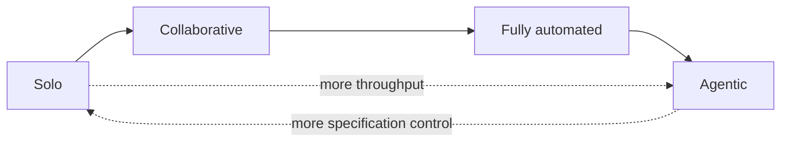

# TDD Interaction Models: Throughput Versus Test Quality

> Splitting the TDD cycle between human and agent has four shapes, each trading throughput against how much of the implementation your tests reach.

A TDD cycle has two halves — writing the test and writing the production code — and each half goes to a human or an agent. That gives four interaction models: solo, collaborative, fully automated, and agentic. An exploratory study of the four found that agentic workflows produce functionally correct production code fastest, that collaborative workflows produce better-organized test suites, and that "the choice of interaction model should depend on the development objective" ([Mock and Russo, 2026](https://arxiv.org/abs/2607.22406v1)).

## Why the interaction model matters

How much of the loop you delegate has a measurable cost, and it outlives the benefit. Repositories adopting autonomous coding agents saw static-analysis warnings rise roughly 18% and cognitive complexity roughly 39%, and those effects persisted across settings after the throughput gains had faded ([Agarwal, He and Vasilescu, 2026](https://arxiv.org/abs/2601.13597v2)). The delegation boundary is the lever that sets that trade, so it is worth choosing deliberately rather than by default.

## The four interaction models

| Model | Writes the test | Writes the production code | Human control during the cycle |
|-------|-----------------|----------------------------|-------------------------------|
| Solo | Human | Human | Full |
| Collaborative | Human | Agent | Per iteration, through prompts |
| Fully automated | Agent | Agent | Trigger and monitor only |
| Agentic | Multi-agent platform | Multi-agent platform | Initial prompt only |

The models form a ladder of delegation rather than four unrelated options. Each rung hands the agent one more decision, and the collaborative rung is the last one where a human still authors the specification that the tests encode ([Mock and Russo, 2026](https://arxiv.org/abs/2607.22406)).

The ladder is tool-agnostic. The study ran the collaborative rung on a general-purpose chat API and the agentic rung on MetaGPT X ([Mock and Russo, 2026](https://arxiv.org/abs/2607.22406)), but any assistant that can run a test command fills the first role and any orchestrator that runs sub-agents to completion fills the second. The choice is about where the human gate sits, not which vendor you use.

## Read the evidence before you apply it

The study behind this comparison is exploratory, and three conditions bound what it supports.

The sample is small and so is the task. Sixteen IT professionals took part, split nine solo and seven collaborative, working for 40 minutes on a `TextFormatter` class that centers one word and then two words in a line. The authors state the tasks "did not require understanding complex APIs or class structures" and that the sample size "may reduce the statistical power of the comparisons involving human participants" ([Mock and Russo, 2026](https://arxiv.org/abs/2607.22406v1)).

The arms did not run the same models. The collaborative and fully automated workflows used GPT-3.5 Turbo through its API, while the agentic workflow ran MetaGPT X configured with ChatGPT 5 and Claude Sonnet 4 ([Mock and Russo, 2026](https://arxiv.org/abs/2607.22406)). The agentic arm's speed advantage is therefore confounded with a two-generation model gap, and so is the collaborative arm's test-quality advantage.

Test quality here means structure and coverage, not defect detection. A comparison of LLM-generated and human-written unit tests on real Python bugs found human tests scored higher on line coverage (88.5% against 84.8%) and branch coverage (82.1% against 75.2%) while detecting 17.2% of faults against the LLM suite's 69%, and concluded that coverage is an insufficient proxy for fault-detection capability ([Vathana et al., 2026](https://arxiv.org/abs/2606.08588v1)). A better-organized suite is not automatically a suite that catches more bugs.

## Why it works

The cost of full autonomy is structural rather than behavioral. In TDD the test suite derives from the functional specification, so its reach is bounded by what the specification asks for. Anything the implementer adds beyond that — extra guard clauses, input normalization, defensive branches — sits outside the suite by construction. Mock and Russo state this directly for the agentic case: agents "may also introduce additional implementation decisions that are not explicitly required by the functional specifications, resulting in untested decision points" ([Mock and Russo, 2026](https://arxiv.org/abs/2607.22406v1)).

Keeping a human on the test-writing half does not make the human a better test author. It constrains scope. Specification and implementation come from different parties, so unrequested behavior has to survive a review round before it enters the codebase. That is the same reasoning behind [test-driven agent development](../verification/tdd-agent-development.md), where the test file is the contract the agent implements against.

That asymmetry is why the field data above shows the speed gain fading while the complexity increase holds: a branch nobody specified is a branch nobody wrote an assertion for, and it stays that way. The [velocity-quality asymmetry](velocity-quality-asymmetry.md) covers the same shape at the level of a whole codebase.

## Triggers and constraints

Pick the rung from the objective, then bound the agent's authority to match.

- Optimizing for throughput on well-specified work: run the agentic rung, and gate the merge on a review pass that looks specifically for branches the specification never asked for.
- Optimizing for a pinned specification: run the collaborative rung, and accept that a human sits in every red-green iteration.
- Working on anything safety-relevant or hard to reverse: keep the test half human and treat the agent's output as a proposal, as in [human-in-the-loop](human-in-the-loop.md) workflows.

The rung sets where the specification gets pinned; it does not by itself decide whether anyone checks what the implementation added on top.

## When this backfires

Gating the test-writing half on a human costs more than it returns under several conditions.

- The task is large. The study measured 40-minute string-formatting exercises. At repository scale the human becomes the bottleneck: TDFlow reaches 94.3% on SWE-Bench Verified when handed human-written tests, and its authors name "writing successful reproduction tests" as the primary remaining obstacle to human-level performance ([Han et al., 2025](https://arxiv.org/abs/2510.23761v2)).
- You are optimizing for defect detection. On that axis the human advantage reverses by a factor of four ([Vathana et al., 2026](https://arxiv.org/abs/2606.08588)). Choose the collaborative rung to pin the specification, not to maximize bugs found per test.
- Your models are current. The collaborative arm ran on GPT-3.5 Turbo. A 2026-vintage model in the same loop is not the configuration that was measured, and the observed gap may not survive the upgrade.
- Reviewer time is the scarce resource. Collaborative TDD puts a human in every iteration, so the cost lands on each cycle rather than once at the end.
- Nobody reviews the extra branches. The untested-decision-point cost is only avoidable if someone inspects what the agent added beyond the specification.

Automating the test half does not rescue you either. Most LLM-generated Python test suites in one assessment contained at least one error or test smell, with assertion errors making up 64% of errors and lack of cohesion of test cases the most common smell at 41% ([Alves et al., 2025](https://arxiv.org/abs/2506.14297v1)).

## Example

The study's own setup is the clearest case. Participants implemented a `TextFormatter` class with `setLineWidth` plus two centering functions, one for a single word and one for two words ([Mock and Russo, 2026](https://arxiv.org/abs/2607.22406)). Nothing in that specification says what happens when the line width is negative, or when a word is longer than the line. A human writing the tests first either specifies those cases or does not, and the implementation stays bounded either way. An agent handed the whole cycle can add handling for both, ship code that passes every test, and leave two branches with no assertion behind them.

## Key Takeaways

- The TDD cycle splits into a test half and a code half, and delegating each half to a human or an agent gives four interaction models with different trade-offs ([Mock and Russo, 2026](https://arxiv.org/abs/2607.22406)).
- Full autonomy is fastest and leaves untested decision points behind, because spec-derived tests cannot cover branches the specification never requested.
- The supporting study is exploratory: 16 participants, 40-minute toy tasks, and different model generations across the arms.
- "Better test suite" in this evidence means better structured and better covered, which does not track defect detection ([Vathana et al., 2026](https://arxiv.org/abs/2606.08588)).
- Pick the rung by objective, then spend the saved time reviewing what the agent added beyond the specification.

## Related

- [Test-Driven Agent Development: Tests as Spec and Guardrail](../verification/tdd-agent-development.md) — using tests as both specification and automated guardrail for agent work
- [Red-Green-Refactor with Agents: Tests as the Spec](../verification/red-green-refactor-agents.md) — running the TDD cycle as separate agent invocations per phase
- [The Velocity-Quality Asymmetry: Why AI Speed Gains Fade Without QA Investment](velocity-quality-asymmetry.md) — the field-data version of the same speed-against-quality trade
- [Human-in-the-Loop](human-in-the-loop.md) — where to place human checkpoints in an agent workflow
- [Verification-Centric Development](verification-centric-development.md) — organizing a workflow around what can be verified rather than what can be generated
