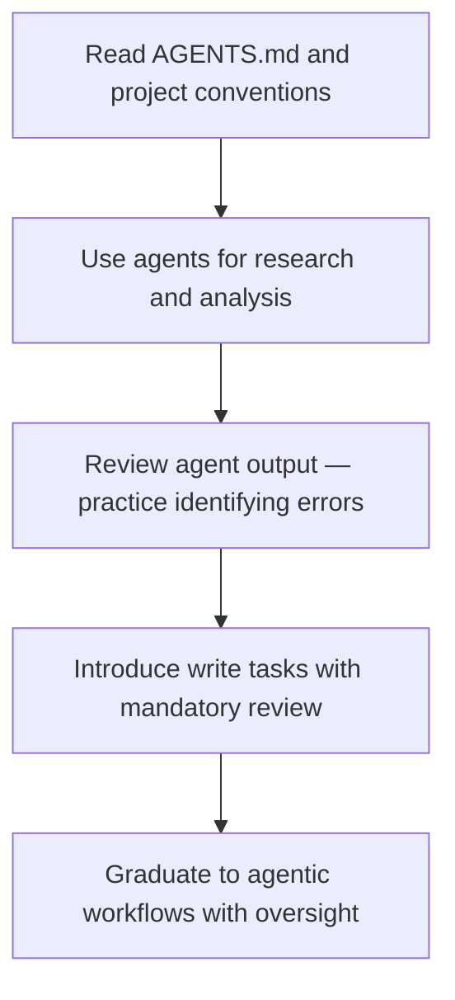

# Team Onboarding for Agent Workflows

> Team onboarding for agent workflows aligns a team on shared infrastructure, trust calibration, and vocabulary before individual adoption diverges.

## Why Teams Stall

You can adopt agent workflows individually through personal experimentation. Teams need coordination. Without shared conventions, team members develop incompatible habits: different prompt styles, conflicting agent configurations, no agreement on when to trust output. The result is inconsistent quality and a lack of compounding improvement — each person reinvents the same lessons.

Effective onboarding addresses this by aligning the team on three things: shared infrastructure, calibrated trust, and a common vocabulary.

## Shared Infrastructure First

The foundation is a project-level instructions file. Per the [AGENTS.md standard](https://agents.md), this file describes project conventions, constraints, and agent guidance in a location all tools can read. Every team member reads it; every agent reads it. It becomes the source of truth for how agents should behave on your project.

Skills and commands live in version control alongside the code they support. Your team reviews changes to agent configuration the same way you review code changes — through pull requests, with comment and approval. This prevents configuration drift and creates an audit trail.

The [repository bootstrap checklist](repository-bootstrap-checklist.md) covers the mechanics of setting this up.

## Onboarding Sequence

Start with read-only agent tasks before write tasks. Research and analysis carry lower risk — the agent produces output the developer evaluates before acting. Write tasks (code generation, file editing, PRs) require more trust and better review habits. Starting with read-only builds familiarity with agent behavior without the risk of bad output landing in the codebase.

A practical sequence:



Teach the trust spectrum early. Agents perform well on high-context, well-specified tasks: boilerplate generation, refactoring with clear rules, summarizing documentation, writing tests against defined interfaces — areas where [productivity gains are consistently documented](https://arxiv.org/html/2511.04824v1). They perform poorly on novel architecture decisions, ambiguous requirements, and tasks requiring judgment about business context — domains where [validation criteria are unclear and business policy interpretation is required](https://venturebeat.com/ai/why-ai-coding-agents-arent-production-ready-brittle-context-windows-broken). Making this explicit prevents both over-reliance and under-use.

## Shifting Review Culture

Reviewing agent output is structurally different from reviewing human code. Human code review often focuses on style, naming, and structural preferences. Agent output review focuses on correctness: does this do what was intended, are there subtle errors, did the agent hallucinate an API or misunderstand a constraint?

Common patterns to teach reviewers:

- Verify imports and API calls against actual library documentation, not just the agent's claim
- Check for edge cases the agent handled silently — agents often assume happy paths
- Confirm the agent addressed the actual requirement, not a simpler adjacent one
- Look for context gaps: the agent may have missed a constraint not in its context window

## Common Pitfalls

**Over-reliance**: Trusting agent output without review because it "looks right." Agent output can be plausible and wrong. Verification habits must be built early.

**Under-trust**: Refusing to delegate anything meaningful because of occasional errors. This loses most of the productivity gain. Calibrate based on task type, not general skepticism.

**Inconsistent usage**: Some team members use agents heavily, others not at all. This creates knowledge asymmetry and makes the shared infrastructure undervalued. Minimum baseline adoption helps.

**Vocabulary mismatch**: Terms like "agent," "skill," "command," and "prompt" mean different things in different tools. Establish shared definitions early — what your team means by these terms in your specific setup.

## Shared Vocabulary

Align the team on these terms before deeper adoption:

| Term | Meaning |
|------|---------|
| Agent | An AI model performing a task with tool access |
| Skill | A reusable capability an agent can invoke |
| Command | A predefined agent workflow triggered by a slash command |
| Prompt | The instruction given to an agent for a specific task |
| Context window | The information available to the agent at runtime |

Shared vocabulary prevents confusion in code reviews and discussions about agent behavior.

## Maintaining the Infrastructure

Agent infrastructure decays without maintenance. Skills become outdated as codebases evolve. Commands that worked for one project phase may not fit the next. Assign ownership: someone is responsible for keeping AGENTS.md current, reviewing skill changes, and evaluating new agent capabilities as they ship.

Schedule periodic reviews of agent output quality. If output quality drops, the cause is usually stale instructions or changed codebase conventions — not a change in the model. Treat infrastructure maintenance as ongoing, not a one-time setup.

## When This Backfires

Structured team onboarding adds coordination overhead. On small or short-lived teams, that overhead can outweigh the benefit:

- **Team of two or three**: Synchronizing on shared conventions, reviewing AGENTS.md changes via PR, and scheduling group calibration sessions costs more time than individual drift would. Small teams converge naturally through pair work.
- **Exploratory or prototype phases**: When requirements change weekly, shared agent infrastructure becomes outdated before it stabilizes. Premature standardization locks in conventions that don't yet fit the problem.
- **Low CI discipline**: AGENTS.md and shared skills decay quickly without consistent maintenance and code review. Teams that skip reviewing agent configuration changes in PRs will find infrastructure diverges from codebase reality within weeks, producing worse agent output than no instructions at all.

## Example

The following illustrates a concrete onboarding sequence for a team adopting Claude Code for the first time. It follows the read-only-first approach described above.

**Week 1 — Read-only tasks only.** Each team member runs the same research prompt against the codebase and compares output:

```
Using the codebase, answer: what happens when a payment authorization fails?
Trace the code path from the API handler to the database write.
Cite specific file paths and function names.
```

The team reviews the responses together, noting where the agent was accurate, where it hallucinated file names, and where it missed branching logic. This calibrates trust without risking any writes to the codebase.

**Week 2 — Write tasks with mandatory review.** Team members use Claude Code to generate test stubs for existing functions:

```bash
claude "Write Vitest unit tests for src/services/payments.ts.
Cover the authorize(), capture(), and refund() functions.
Use vi.mock('../http-client') for external HTTP calls.
Do not modify the source file."
```

Each generated test file is reviewed before running — reviewers check that the agent tested the actual function signatures, not invented ones, and that assertions reflect the real return types.

**Week 3 — Establish shared vocabulary and AGENTS.md ownership.** The team aligns on the shared vocabulary table from this page and assigns one person as AGENTS.md maintainer. Any PR that changes agent-visible conventions (naming rules, test patterns, directory layout) must also update AGENTS.md.

This three-week sequence surfaces agent failure modes in a controlled way before write access is standard practice.

## Key Takeaways

- Start with shared project-level instructions (AGENTS.md) before individual adoption varies
- Introduce read-only agent tasks before write tasks to build trust calibration safely
- Agent output review focuses on correctness, not style — teach this distinction explicitly
- Establish shared vocabulary for agent concepts before teams diverge on terminology
- Agent infrastructure requires ongoing maintenance; assign ownership to prevent decay

## Related

- [AGENTS.md: A README for AI Coding Agents](../standards/agents-md.md)
- [Repository Bootstrap Checklist](repository-bootstrap-checklist.md)
- [Agent-Powered Codebase Q&A and Onboarding](codebase-qa-onboarding.md)
- [Agent Debugging](../observability/agent-debugging.md)
- [The AI Development Maturity Model: From Skeptic to Agentic](ai-development-maturity-model.md)
- [Steering Running Agents: Mid-Run Redirection and Follow-Ups](../agent-design/steering-running-agents.md)
- [Agent-Driven Greenfield Projects](agent-driven-greenfield.md)
- [Agent Governance Policies](agent-governance-policies.md)
- [Central Repo and Shared Agent Standards](central-repo-shared-agent-standards.md)
- [Getting Started: Setting Up Your Instruction File](getting-started-instruction-files.md)
- [Agent Environment Bootstrapping](agent-environment-bootstrapping.md)
- [Lay the Architectural Foundation by Hand Before Delegating to Agents](architectural-foundation-first.md)
