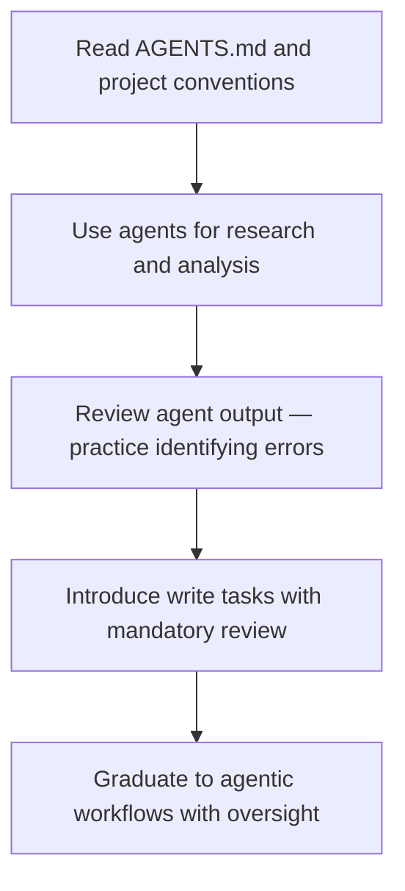

# Team Onboarding for AI Agent Workflows and Adoption

> Team onboarding for agent workflows aligns a team on shared infrastructure, trust calibration, and vocabulary before individual adoption diverges.

## Why teams stall

You can adopt agent workflows on your own through experimentation. Teams need coordination. Without [shared conventions](central-repo-shared-agent-standards.md), team members build incompatible habits: different prompt styles, conflicting agent configurations, and no agreement on when to trust output. Quality stays inconsistent and improvements never compound, because each person relearns the same lessons.

Good onboarding fixes this. It aligns the team on three things: shared infrastructure, calibrated trust, and a common vocabulary.

## Shared infrastructure first

Start with a project-level instructions file. Following the [AGENTS.md standard](https://agents.md), this file describes project conventions, constraints, and agent guidance in a place all tools can read. Every team member reads it, and every agent reads it. It becomes the source of truth for how agents should behave on your project.

[Skills and commands live in version control](../instructions/prompt-governance-via-pr.md) alongside the code they support. Your team reviews changes to agent configuration the same way you review code changes: through pull requests, with comment and approval. This prevents configuration drift and creates an audit trail.

The [repository bootstrap checklist](repository-bootstrap-checklist.md) covers the mechanics of setting this up.

## Onboarding sequence

Start with read-only agent tasks before write tasks. Research and analysis carry lower risk, because the agent produces output the developer checks before acting. Write tasks such as code generation, file editing, and PRs need more trust and better review habits. Starting read-only [builds familiarity with agent behavior](codebase-qa-onboarding.md) without the risk of bad output landing in the codebase.

A practical sequence:


```mermaid
graph TD
    A[Read AGENTS.md and project conventions] --> B[Use agents for research and analysis]
    B --> C[Review agent output — practice identifying errors]
    C --> D[Introduce write tasks with mandatory review]
    D --> E[Graduate to agentic workflows with oversight]
```

Teach the trust spectrum early. Agents do their most reliable work on high-context, well-specified tasks: boilerplate generation, mechanical refactoring with clear rules, summarizing documentation, and writing tests against defined interfaces. An [empirical study of agentic refactoring](https://arxiv.org/abs/2511.04824) found agents handle exactly this kind of low-level, consistency-oriented edit, such as renames and type changes, and deliver small but statistically significant structural improvements, while not improving high-level design. That boundary is the point. Agents do poorly on novel architecture decisions, ambiguous requirements, and tasks that need judgment about business context. Saying so prevents both over-reliance and under-use.

## Shifting review culture

Reviewing agent output differs from reviewing human code. Human code review often focuses on style, naming, and structural preferences. [Agent output review focuses on correctness](../code-review/agent-assisted-code-review.md): does this do what was intended, are there subtle errors, did the agent hallucinate an API or misunderstand a constraint?

Teach reviewers these patterns:

- Verify imports and API calls against actual library documentation, not just the agent's claim
- Check for edge cases the agent handled silently — agents often assume happy paths
- Confirm the agent addressed the actual requirement, not a simpler adjacent one
- Look for context gaps: the agent may have missed a constraint not in its context window

## Common pitfalls

Over-reliance is trusting agent output without review because it looks right. Agent output can be plausible and wrong, so build verification habits early.

Under-trust is [refusing to delegate anything meaningful](ai-development-maturity-model.md) because of occasional errors. This loses most of the productivity gain. Calibrate on task type, not general skepticism.

Inconsistent usage is when [some team members use agents heavily and others not at all](agent-governance-policies.md). This creates knowledge gaps and makes the shared infrastructure look unimportant. A minimum baseline of adoption helps.

Vocabulary mismatch is when [terms like agent, skill, command, and prompt](../agent-design/agent-terminology-disambiguation.md) mean different things in different tools. Agree on shared definitions early: what your team means by these terms in your specific setup.

## Shared vocabulary

Align the team on these terms before deeper adoption:

| Term | Meaning |
|------|---------|
| Agent | An AI model performing a task with tool access |
| Skill | A reusable capability an agent can invoke |
| Command | A predefined agent workflow triggered by a slash command |
| Prompt | The instruction given to an agent for a specific task |
| Context window | The information available to the agent at runtime |

Shared vocabulary prevents confusion in code reviews and discussions about agent behavior.

## Maintaining the infrastructure

Agent infrastructure decays without maintenance. Skills go out of date as codebases evolve. Commands that worked for one project phase may not fit the next. Assign ownership, so one person keeps AGENTS.md current, reviews skill changes, and evaluates new agent capabilities as they ship.

Schedule regular reviews of agent output quality. If output quality drops, the cause is usually stale instructions or changed codebase conventions, not a change in the model. Treat infrastructure maintenance as ongoing, not a one-time setup.

## When this backfires

Structured team onboarding adds coordination overhead. On small or short-lived teams, that overhead can outweigh the benefit:

- Team of two or three: agreeing on shared conventions, reviewing AGENTS.md changes via PR, and scheduling group calibration sessions costs more time than individual drift would. Small teams converge naturally through pair work
- Exploratory or prototype phases: when requirements change weekly, shared agent infrastructure goes out of date before it settles. Standardizing too early locks in conventions that do not yet fit the problem
- Low CI discipline: AGENTS.md and shared skills decay quickly without steady maintenance and code review. Teams that skip reviewing agent configuration changes in PRs find the infrastructure drifts from codebase reality within weeks, producing worse agent output than no instructions at all

## Example

Here is a concrete onboarding sequence for a team adopting Claude Code for the first time. It follows the read-only-first approach described above.

Week 1, read-only tasks only. Each team member runs the same research prompt against the codebase and compares output:

```
Using the codebase, answer: what happens when a payment authorization fails?
Trace the code path from the API handler to the database write.
Cite specific file paths and function names.
```

The team reviews the responses together, noting where the agent was accurate, where it made up file names, and where it missed branching logic. This calibrates trust without risking any writes to the codebase.

Week 2, write tasks with mandatory review. Team members use Claude Code to generate test stubs for existing functions:

```bash
claude "Write Vitest unit tests for src/services/payments.ts.
Cover the authorize(), capture(), and refund() functions.
Use vi.mock('../http-client') for external HTTP calls.
Do not modify the source file."
```

Reviewers check each generated test file before running it. They confirm the agent tested the actual function signatures, not invented ones, and that assertions reflect the real return types.

Week 3, establish shared vocabulary and AGENTS.md ownership. The team aligns on the shared vocabulary table from this page and assigns one person as AGENTS.md maintainer. Any PR that changes agent-visible conventions, such as naming rules, test patterns, or directory layout, must also update AGENTS.md.

This three-week sequence surfaces agent failure modes in a controlled way before write access is standard practice.

## Key Takeaways

- Start with shared project-level instructions (AGENTS.md) before individual adoption varies
- Introduce read-only agent tasks before write tasks to build trust calibration safely
- Agent output review focuses on correctness, not style — teach this distinction explicitly
- Establish shared vocabulary for agent concepts before teams diverge on terminology
- Agent infrastructure requires ongoing maintenance; assign ownership to prevent decay

## Related

- [AGENTS.md: A README for AI Coding Agents](../standards/agents-md.md)
- [Repository Bootstrap Checklist](repository-bootstrap-checklist.md)
- [Getting Started: Setting Up Your Instruction File](../instructions/getting-started-instruction-files.md)
- [Agent-Powered Codebase Q&A and Onboarding](codebase-qa-onboarding.md)
- [The AI Development Maturity Model: From Skeptic to Agentic](ai-development-maturity-model.md)
- [Agent Governance Policies](agent-governance-policies.md)
- [Central Repo and Shared Agent Standards](central-repo-shared-agent-standards.md)
- [Agent Environment Bootstrapping](agent-environment-bootstrapping.md)
