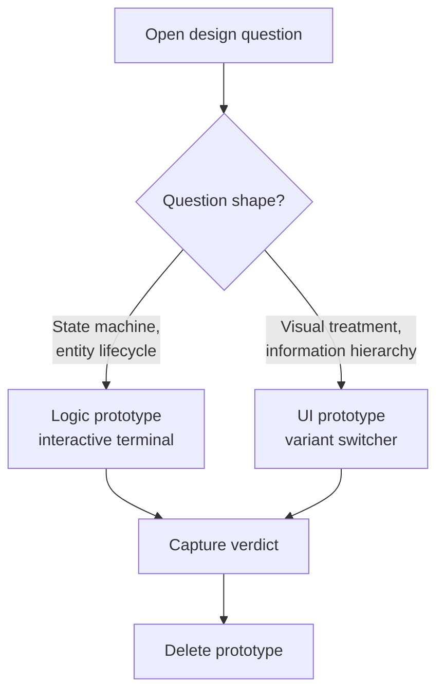
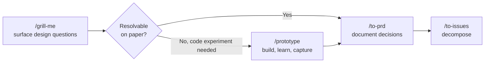

# Throwaway-Prototype Skill: Build to Discard, Keep Only the Answer

> A throwaway-prototype skill forbids tests, error handling, and abstractions to keep the spike cheap; the only durable output is the verdict it produces.

Agents over-engineer prototypes. Given "spike to see if approach X works", a default agent adds types, error handling, lint compliance, and tests — burning hours and producing code so polished it gets merged when it should have been deleted. Anthropic's eval team added a dedicated over-engineering eval to Claude Code for exactly this failure mode ([Demystifying evals for AI agents — Anthropic](https://www.anthropic.com/engineering/demystifying-evals-for-ai-agents)). A skill with explicit "this will be deleted" framing changes the agent's quality target for one bounded session.

Matt Pocock's open-source [`/prototype` skill](https://github.com/mattpocock/skills/blob/main/skills/engineering/prototype/SKILL.md) is the worked reference. The pattern is portable to any agent harness that supports model-invocable skills.

## Pick the question shape first

The skill's first job is choosing one of two prototype shapes. Misidentifying the shape "wastes the whole prototype" ([SKILL.md](https://github.com/mattpocock/skills/blob/main/skills/engineering/prototype/SKILL.md)).

| Branch | Question shape | Form |
|--------|---------------|------|
| Logic | "Does this state model work?" | Tiny interactive terminal app that pushes the state machine through edge cases |
| UI | "What should this look like?" | Several radically different variations on one route, switchable via `?variant=` URL parameter and a floating bottom bar |

The branching is not cosmetic. A logic question pushed into a UI variant switcher produces three pretty screens that answer nothing. A UI question pushed into a terminal app loses the visual judgment that was the point. Pocock's skill makes the branch decision its first instruction precisely because both directions look plausible to an agent without explicit guidance.

## The load-bearing constraint is what the skill forbids

A skill that says "build a prototype" produces an over-engineered prototype. The skill earns its keep by listing what is not allowed:

- No test files
- No error handling beyond what is needed for the program to run
- No type-narrowing or refinement past the minimum
- No new abstractions or shared modules
- In-memory state only, unless persistence is the question being answered
- One entry point — a single command launches the whole thing

These constraints invert the default reward signal. Agent training rewards completeness. The skill explicitly de-rewards it for the duration of one task. This is the same mechanism that gives `/grill-me` and `/tdd` their reliability — a process-gate skill enforces one constraint at the right moment that general instructions cannot, because general instructions read as reference material while skills fire mid-flow ([Skill authoring best practices — Claude docs](https://platform.claude.com/docs/en/agents-and-tools/agent-skills/best-practices)).

## Capture the verdict before the code dies

The answer is the only thing worth keeping. Pocock's skill writes the verdict to a durable surface — commit message, ADR, GitHub issue, or a `NOTES.md` next to the prototype — before the prototype directory is deleted ([SKILL.md](https://github.com/mattpocock/skills/blob/main/skills/engineering/prototype/SKILL.md)).

The capture step is not optional. Skipping it means the next agent session re-prototypes the same question, paying the cost twice with no compounding learning. This is the modern restatement of Fred Brooks: "plan to throw one away; you will, anyhow" ([Wikiquote: Fred Brooks](https://en.wikiquote.org/wiki/Fred_Brooks)). What survives the throwing-away is the decision, not the code.

## The "prototype that ships" anti-pattern

The classic prototype failure mode is structural: stakeholders see a working UI and demand to ship it ([The Prototype Pitfall — Coding Horror](https://blog.codinghorror.com/the-prototype-pitfall/)). Agents amplify the risk because their output looks polished even when forbidden to polish — variable names are sensible, the README is plausible, the diff compiles.

Two structural gates keep the skill honest:

- Naming and location: prototypes live in a `prototypes/` directory (or a scratch branch with a `prototype/` prefix). The path itself is the disposability signal that survives code review.
- Import-graph enforcement: a CI rule fails the build on imports from `prototypes/` into any production path. Without this rule, the disposable artifact silently becomes the production system through one accidental import.

The Pragmatic Programmers' rule applies unchanged: "Prototypes are throwaway. Do not refactor a prototype into production code" ([Swizec Teller summary](https://swizec.com/blog/my-favorite-lessons-from-pragmatic-programmer/)). The skill produces the right material. The structural gates prevent its misuse.

## Distinct from a tracer bullet

A tracer bullet and a throwaway prototype both cut end-to-end and look minimal, but they have opposite lifecycles.

| | Tracer bullet | Throwaway prototype |
|---|---|---|
| Purpose | Evolves into the final system | Resolves a question, then dies |
| Quality bar | Production-grade, lean | Disposable, no polish |
| What survives | The slice itself | The verdict only |
| When invoked | Decomposition of a known feature | Open design decision blocking decomposition |

The distinction is canonical to 'The Pragmatic Programmer': tracer code is "lean but complete" and "forms part of the skeleton of the final system"; prototyping is exploring a specific aspect where "the main purpose is learning" and "after you've learned from the prototype you'll throw away the code" ([Tracer bullets — Barbarian Meets Coding](https://www.barbarianmeetscoding.com/notes/books/pragmatic-programmer/tracer-bullets/)). The two skills compose: `/prototype` resolves the unknown, then `/to-issues` decomposes the now-known work into tracer-bullet slices ([5 Agent Skills I Use Every Day — AI Hero](https://www.aihero.dev/5-agent-skills-i-use-every-day)).

## Composition in a skill library

The skill slots between question-surfacing and specification-writing in a [daily-use skill library](daily-use-skill-library.md).

`/grill-me` walks the design tree ([Grill Me technique](../patterns/agent-design/grill-me-technique.md)). When a branch cannot be resolved by inspection or by reading the codebase, `/prototype` fires. The verdict the prototype produces feeds the PRD step. The PRD then decomposes into tracer-bullet issues. The prototype directory itself is deleted before the PRD is filed.

## When this backfires

The pattern adds cost without value in four conditions:

- Mature, well-specified problem spaces. CRUD on a known schema, library upgrades, refactor under green tests. The design tree is shallow, so the ceremony of building and discarding a prototype exceeds the information it surfaces. Run `/grill-me` → `/to-prd` directly.
- No import-graph or branch-protection enforcement. Without the structural gates, the skill produces a working artifact that stakeholders or future agents pull into production. The "prototype that ships" anti-pattern dominates and the skill becomes a liability — the same [demo-to-production gap](../patterns/anti-patterns/demo-to-production-gap.md) that turns any throwaway artifact into an unmaintained dependency.
- Solo work with no audience for the verdict. The skill's value is the durable record. Solo developers under time pressure skip the capture step, lose the answer, and re-prototype the same question next sprint — paying the cost without compounding the learning.
- Pure-UI tasks with an approved design spec. Generating "radically different variations" behind the `?variant=` switcher when the Figma is signed off is rework, not exploration. The UI branch fires correctly only when the visual treatment itself is the open question.

The Specification-Driven Development critique applies in those conditions: a `/prototype` skill invoked outside its preconditions is "sanctioned vibe-coding" ([SDD essay — DEV Community](https://dev.to/pockit_tools/specification-driven-development-how-to-stop-vibe-coding-and-actually-ship-production-ready-5788)). Audit whether the skill is firing only on real unknown-unknowns before keeping it in the library.

A prior failure condition is worth naming: the skill never firing at all. Vercel's January 2026 evals found that in 56% of cases an agent never invoked the skill it needed even with the skill installed, and that past roughly 32 installed skills, descriptions truncate before the agent reads them — the "discovery ceiling" ([Skills and the discovery ceiling](https://dev.to/cdelgado70/skills-and-the-discovery-ceiling-why-your-ai-coding-agent-ignores-most-of-what-you-install-45f9)). Adding an explicit `/prototype` trigger to `AGENTS.md` — "when a design question can only be resolved by code, invoke prototype" — lifted comparable skills' trigger rates above 95% in Vercel's follow-up ([AGENTS.md outperforms skills](https://vercel.com/blog/agents-md-outperforms-skills-in-our-agent-evals)). Do not rely on the skill being auto-discovered in a large library. Pin its invocation condition in the always-loaded instruction surface.

## Key Takeaways

- The skill's value is what it forbids — no tests, no error handling, no abstractions — not what it produces.
- Pick the question shape first: logic prototypes are interactive terminal apps; UI prototypes are variant switchers on one route.
- The verdict is the only durable output. Capture it in a commit, ADR, or `NOTES.md` before the prototype is deleted.
- Structural gates (`prototypes/` directory, import-graph CI rule) prevent the "prototype that ships" anti-pattern that agents amplify because their output looks polished.
- Distinct from a tracer bullet: prototypes die, tracer bullets evolve into the production system.

## Related

- [Grill Me: Developer-Initiated Plan Interrogation](../patterns/agent-design/grill-me-technique.md) — surfaces the design questions that this skill resolves.
- [Daily-Use Skill Library: Encoding Your Process as Agent Skills](daily-use-skill-library.md) — the pipeline this skill slots into.
- [Prototype Before Optimizing](prototype-before-optimizing.md) — temporal-budget pattern; complementary, addresses a different question.
- [Plan Mode: Read-Only Exploration Before Implementation](../tools/claude/plan-mode.md) — alternative for questions resolvable without writing code.
