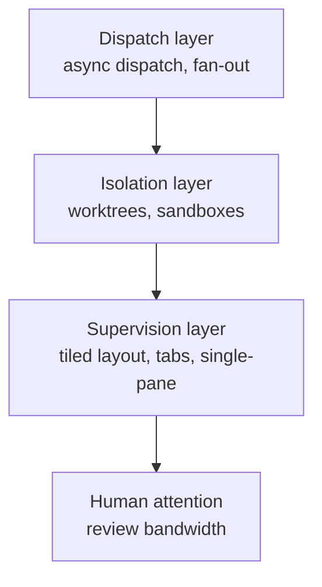

# Tiled Agent Layout: Supervising Parallel Agents Through Dedicated Panes

> Tiled agent layouts split the screen into panes — one per agent — so a supervisor can see all concurrent sessions at once instead of switching between tabs. The mechanism lowers switching cost; it does not raise review capacity.

## What Tiled Layout Solves

Once concurrent agent count exceeds two or three, tab-based interaction breaks down. Each switch costs an action (click, keystroke) plus a context-load (which agent is this, what was it doing). The supervisor stops checking on agents that aren't currently focused — they go dark behind the active tab.

Cursor 3.1 (released 2026-04-13) introduced **Tiled Layout** to address exactly this surface: "split your current view into panes to run and manage several agents in parallel" and "compare outputs across agents without jumping between tabs." Layouts persist across sessions. ([Source: Cursor changelog 3.1](https://cursor.com/changelog/3-1)) It extends the [Cursor Agents Window](../tools/cursor/agents-window.md) introduced in Cursor 3, which already supported "Agent Tabs" for "side-by-side or in a grid" viewing. ([Source: Cursor changelog 3.0](https://cursor.com/changelog/3-0))

The pattern is not Cursor-specific. Practitioners simulate it with terminal multiplexers (tmux, zellij) and multiple terminal windows. Simon Willison: "I frequently have multiple terminal windows open running different coding agents in different directories." ([Source](https://simonwillison.net/2025/Oct/5/parallel-coding-agents/))

## The Mechanism: Switching Cost, Not Capacity

Tiled layout works because it lowers the per-switch cost of supervising N agents. The supervisor detects "stalled / waiting / finished" by glance rather than by polling.

It does not raise the underlying capacity ceiling. Review bandwidth — the number of agent outputs one human can meaningfully evaluate per unit time — is set by task complexity, not by UI chrome. Willison: "I can only focus on reviewing and landing one significant change at a time, but I'm finding an increasing number of tasks that can still be fired off in parallel without adding too much cognitive overhead to my primary work." ([Source](https://simonwillison.net/2025/Oct/5/parallel-coding-agents/))

This distinction matters for adoption decisions. Tiled layout is justified when:

- The work is genuinely parallelisable across independent surfaces (separate modules, separate repos, separate concerns)
- Most tasks run mostly autonomously between human checkpoints
- The supervisor has classified each task before dispatch (see [Attention Management with Parallel Agents](../human/attention-management-parallel-agents.md))

It backfires when:

- Each agent pauses frequently for human input — the supervisor faces simultaneous decisions across panes and degrades each one
- Tile size drops below readable threshold — five panes on a laptop screen show motion, not content, creating a false sense of supervision
- Tasks have mixed complexity — switching between an architecture decision pane and a rename pane is more expensive than switching between two renames

## Composition with Dispatch

Tiled layout sits at the **UX layer**. It composes with dispatch and isolation patterns at lower layers:



Dispatch decides how work is fanned out (see [Async Non-Blocking Subagent Dispatch](../multi-agent/async-non-blocking-subagent-dispatch.md)). Isolation decides whether agents corrupt each other's state (see [Worktree Isolation](worktree-isolation.md)). Tiled layout decides whether the supervisor can see what's happening without paying a per-switch tax. None of these substitute for the others — a tiled view of fire-and-forget agents in a single shared worktree is still wrong.

The Cursor 3 Agents Window is one consolidated implementation: dispatch via `/worktree`, isolation via per-pane worktree, supervision via Agent Tabs and now Tiled Layout. ([Source: Cursor changelog 3.0](https://cursor.com/changelog/3-0))

## Practical Concurrency Range

Reported concurrency from practitioners cluster around 4–10 agents per supervisor. Boris Cherny (creator of Claude Code) "runs five Claude Code sessions locally in terminal tabs, plus another five to ten in the browser, and even starts sessions from his phone to check on later." ([Source: Addy Osmani](https://addyosmani.com/blog/coding-agents-manager/)) Addy Osmani's three-tier model splits a comparable load: 4–5 background sessions handling mechanical tasks alongside 3–5 high-touch sessions requiring architectural judgment. ([Source](https://addyosmani.com/blog/coding-agents-manager/))

A tiled layout with five visible panes is at the edge of that range. Above five, panes become too small to read; the layout reverts to functioning as tabs (one focused, others ignored) regardless of how it appears.

## Failure Modes

- **Attention thrashing.** All panes update simultaneously after a batch dispatch. The supervisor flips between them rapidly without finishing any review. Stagger dispatch (see [Staggered Agent Launch](../multi-agent/staggered-agent-launch.md)) so completion times don't collide.
- **False supervision.** "I'm watching" without actually reading. Treat tiled layout as a notification surface, not a continuous monitor — set explicit checkpoints per agent rather than relying on peripheral vision.
- **Synchronous-permission collapse.** When each agent step requires a permission click (default Claude Code without `--dangerously-skip-permissions`), tiled layout collapses to per-pane click work. Configure per-agent permission policy before fanning out.
- **Hidden drift in small tiles.** A pane below readable size shows motion but not content. The agent goes off-track and the supervisor sees green animation, not the actual error. Either fewer panes or larger screen — not smaller tiles.

## Example

A developer uses Cursor 3.1's Tiled Layout to supervise four parallel agents during a refactor sprint. Each agent works in its own worktree (created via `/worktree`); the panes share the editor window:

```
+-------------------------+-------------------------+
| Pane A: auth refactor   | Pane B: test coverage   |
| (high-touch, in chat)   | (background, fully del.)|
|                         |                         |
+-------------------------+-------------------------+
| Pane C: docs update     | Pane D: db migration    |
| (background, fully del.)| (checkpoint review)     |
|                         |                         |
+-------------------------+-------------------------+
```

Tasks are classified before dispatch using the three-tier model:

| Pane | Task | Tier | What the supervisor watches for |
|------|------|------|---------------------------------|
| A | Refactor auth to OAuth2 + PKCE | Human-in-the-loop | Continuous; this pane drives the others |
| B | Generate unit tests for auth module | Fully delegated | Completion signal only |
| C | Sync API reference from OpenAPI spec | Fully delegated | Completion signal only |
| D | Write Alembic migration for `user_roles` | Checkpoint-based | Schema review before apply |

Tiled layout makes the difference: the auth pane stays in the foreground continuously, while panes B, C, D are visible peripherally. When B reaches a stall ("test failure — clarify expected behaviour?") the supervisor sees the pane stop animating without context-switching out of the auth refactor. Without tiled layout, the same setup requires either alt-tabbing on a timer (interrupts the auth flow) or ignoring the background panes until they're done (defeats the parallelism).

If the same developer tried to run six panes, the layout would degrade — each tile becomes too small to read code diffs. The fix is fewer panes, not a smaller font.

## Key Takeaways

- Tiled layout lowers the per-switch cost of supervising N parallel agents — it does not raise review-bandwidth capacity
- The pattern composes with, but does not replace, async dispatch and worktree isolation — all three layers must hold for parallelism to work
- Practical range is 4–5 panes; above that, tiles become too small to read and the layout degenerates to tabs
- Stagger dispatch and classify tasks per pane before launch — simultaneous updates across panes thrash supervisor attention
- Tool-agnostic equivalents exist via terminal multiplexers (tmux, zellij) and multiple terminal windows; Cursor 3.1 Tiled Layout is the consolidated IDE implementation

## Related

- [Parallel Agent Sessions Shift the Bottleneck from Writing Code to Making Decisions](parallel-agent-sessions.md)
- [Async Non-Blocking Subagent Dispatch](../multi-agent/async-non-blocking-subagent-dispatch.md)
- [Cursor 3 Agents Window](../tools/cursor/agents-window.md)
- [VS Code Agents App: Agent-Native Parallel Task Execution](../agent-design/vscode-agents-parallel-tasks.md)
- [Developer Attention Management with Parallel Agents](../human/attention-management-parallel-agents.md)
- [Worktree Isolation](worktree-isolation.md)
- [Staggered Agent Launch](../multi-agent/staggered-agent-launch.md)
