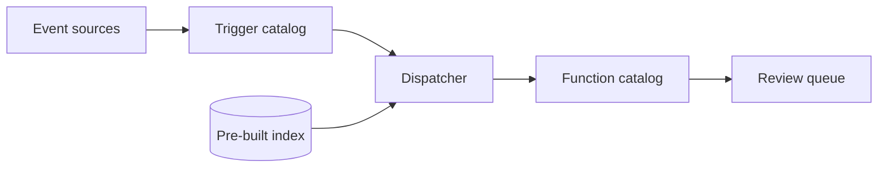

# Trigger-to-Function Architecture for Unprompted Codebase Maintenance

> Wire maintenance events to a short list of callable agent functions over a pre-built index, and damp the queue at three separate points.

A trigger-to-function architecture pairs a catalog of events with a small set of callable agent operations, so maintenance work starts without anyone typing a prompt. Dan Adler, writing on the Sourcegraph blog, names both halves. The triggers are "'8am on Monday,' a new commit landed in an upstream repo, a new Common Vulnerabilities and Exposures (CVE) was published, a supply chain attack was reported, production logs showed high latency in our indexed search pod". The functions are "a Deep Search codebase-wide investigation, a notification to a human via Slack or email, a coding agent deployed to fix an issue and push a PR, a mechanism to generate batch changes across a codebase" ([Sourcegraph, 2026-09-21](https://sourcegraph.com/blog/the-autonomous-codebase)).

## The problem this exists to solve

Brownfield maintenance is the work nobody remembers to ask for. Adler's claim is that the industry has solved the other kind: "we've pretty well nailed the prompt to PR (or issue to PR, or plan file to PR, pick your favorite jumping off point) problem", while "Maintaining existing, 'brownfield' code remains completely unsolved" ([Sourcegraph](https://sourcegraph.com/blog/the-autonomous-codebase)). He does not expect the next model to close the gap, because code quality "has begun to plateau (at pretty damn good code)". A text box gets used when a human already knows there is something to type into it, which is the condition brownfield work fails.

## When this architecture pays

The mechanism is real, and the only measurement of the architecture at scale shows it getting worse as it grows. Check four conditions before building one.

1. The work announces itself. A CVE feed, a dependency release, an alert, or a failed deploy carries the work item with it. Where you would have to scan the codebase to find work, the shape you want is a scheduled sweep instead, which [entropy reduction agents](entropy-reduction-agents.md) covers.
2. The codebase is past the size where an agent can explore its way to the answer. Adler's stated case is "a two-thousand-repo codebase", where an agent "can't clone and grep every single repo before its sandbox times out, before it goes into context window exhaustion psychosis" ([Sourcegraph](https://sourcegraph.com/blog/the-autonomous-codebase)).
3. The function catalog can stay short. Four functions is a catalog. Two hundred is a retrieval problem, measured in Layer 2.
4. Somebody rations the review queue on purpose. Trigger-driven work arrives whether or not a reviewer has capacity, and nothing in the architecture notices.

Condition 2 is the one most likely to be oversold, and the company arguing hardest for it sells the index. Measured independently at single-repo scale, a trained retrieval agent delivered "a small but reproducibly positive resolve-rate lift (+1.2 pp: 25.8% → 27.0%)" across all 500 SWE-Bench Verified instances ([Chen et al., arXiv:2608.05886v1](https://arxiv.org/abs/2608.05886v1)). The efficiency gain was the larger one, at "−15% rounds, −19% tokens on resolved instances". A weak retriever made results worse rather than neutral: "BM25 (precision 0.375) degrades the agent, Jina (0.445) is neutral, and only CodeGrep (0.677) crosses the threshold at which retrieval begins to buy efficiency." Build the index for the multi-repo case.

## Three implementation layers

### Layer 1: Index before any trigger fires

The index is a precondition rather than an optimization, because a fired function has a sandbox budget and cannot spend it discovering the repository. Adler puts the requirement plainly: "Everything worth doing in an enterprise codebase starts with universal code visibility and code understanding" ([Sourcegraph](https://sourcegraph.com/blog/the-autonomous-codebase)). [Whole-codebase visibility as a migration prerequisite](whole-codebase-visibility-migration-prerequisite.md) carries the three-condition check for whether that binds. Standing maintenance runs the same check once and then keeps the index warm.

### Layer 2: Catalog the triggers, cap the functions

The trigger half is the easy half. Dependency bots, CVE feeds, and alert webhooks all ship today, and [Cursor Automations](cursor-automate-event-triggered-automations.md) is one vendor's version of the surface. What nobody writes down is how many functions a dispatcher can pick between before picking becomes the bottleneck. One study of 208 enterprise scenarios across three organizational scales measured it: "Scale, not task complexity, dominates orchestration performance: both architectures perform well at small scale but degrade at enterprise scale as agent discovery noise becomes the primary bottleneck, with simple tasks degrading more sharply than complex ones" ([Dhanyamraju et al., arXiv:2606.20058v1](https://arxiv.org/abs/2606.20058v1)).

The breakdown across catalog sizes is the part worth memorizing: "Simple scenarios degrade from 90–96% (Persona) to 36–54% (Enterprise), while Complex scenarios maintain 73–83%" ([arXiv:2606.20058v1](https://arxiv.org/abs/2606.20058v1)). Persona is under ten agents, Enterprise is two hundred. Finding one to three agents among two hundred turns out to be harder than finding four to seven, so the single-function dispatches a maintenance catalog is mostly made of break first. Adler's list has four functions on it. Treat that as the target size, not a starting point.

### Layer 3: Damp the queue at three points

A trigger-driven system produces work at the rate the world produces events, which is unrelated to the rate anyone can absorb it. Three published mechanisms apply backpressure, and each acts somewhere different.

Delay the trigger. Firing fast is a hazard in a hostile supply chain, because "automated dependency updates can rapidly propagate malicious package releases before maintainers and the broader community have enough time to detect them" ([Tanaka et al., arXiv:2609.16605v1](https://arxiv.org/abs/2609.16605v1)). GitHub's answer was Dependabot cooldown, generally available since July 2025. Among 251 ecosystems in repositories that retained the feature, "97.2% set a general delay. Of these, 64.3% used seven days, while use of each update type setting was below 10%." Adopters reached for one blunt delay over per-update-type tuning.

Merge and prioritize at dispatch. A task manager doing priority inference, event merging and preemption "reduces high-priority queue latency by 14–75%" and improves "related-event correctness by over 20 percentage points at enterprise scale", taking one architecture from 34% to 57% and the other from 35% to 56% ([arXiv:2606.20058v1](https://arxiv.org/abs/2606.20058v1)). Related events arriving separately are the case it recovers.

Rank against a fixed review budget. Across 33,707 agent-authored pull requests from 2,807 repositories, a creation-time model scoring static complexity cues predicts review effort with "AUC >> 0.95 on chronological splits". Spend the budget on the top slice: "At a 20% review budget (i.e., reviewing only the top 20% of PRs ranked by predicted effort), we successfully intercept over two-thirds of the most expensive PRs" ([Minh et al., arXiv:2601.00753v2](https://arxiv.org/abs/2601.00753v2)). The remaining 80% keeps whatever review it already had.

## Triggers and constraints

The architecture is tool-agnostic: every implementation is a webhook, a cron entry, or a feed subscription wired to something that can call an agent, and none of that differs across Claude Code, Copilot, or Cursor. What differs per trigger is who can cause one.

| Trigger class | Who can fire it | What bounds the agent |
|---|---|---|
| Schedule | Whoever owns the cron entry | The function it calls |
| Upstream release or CVE feed | The upstream publisher | A cooldown delay |
| Production alert | Anyone who can move a metric | A dedupe and priority pass |
| Comment or issue | Any repository participant | The commenter's identity, the weakest bound here |

The last row is where the architecture's own author stops: "massive, unsolved problems like identity, authorization, and budget controls remain outstanding" ([Sourcegraph](https://sourcegraph.com/blog/the-autonomous-codebase)). [Comment-triggered agent dispatch](comment-triggered-agent-dispatch.md) covers what a narrow tool grant buys on that row.

## Why it works

The split works because it moves two decisions out of the agent run, and agent runs are measurably bad at both.

The first is whether there is work at all. Asked to judge that, agents act anyway. On FixedBench, 200 human-verified tasks where the correct output is an empty patch, five models across four harnesses proposed undesirable changes "in 35 to 65% of cases", which the authors trace to training where models "are trained to act, e.g., to produce patches, rather than to decide whether action is required" ([Gloaguen et al., arXiv:2605.07769v1](https://arxiv.org/abs/2605.07769v1)). A trigger carrying the work item settles that question before the model is invoked.

The second is where the work lives. Even with interactive exploration, logged agent trajectories "never touch any gold file on 35.2% of OpenAI strict-context samples and 27.2–29.3% of Codex samples". Seeding the run from retrieval changes that: "lexical and RRF seeds add about 0.075 File F1, reach gold earlier, and require substantially fewer post-seed read tokens and tool calls than the random arm" ([Qin and Xie, arXiv:2607.24882v1](https://arxiv.org/abs/2607.24882v1)). An index built before the trigger fires settles that question before the sandbox clock starts.

Dispatch is the part the mechanism does not cover, and it is why Layer 2 caps the catalog rather than growing it.

## When this backfires

- The trigger fires on something already fixed. A stale bug report, a CVE your build never reaches, an alert someone silenced yesterday. The agent patches anyway in 35 to 65% of no-change cases ([arXiv:2605.07769v1](https://arxiv.org/abs/2605.07769v1)). [Evidence-conditioned execution](../verification/evidence-conditioned-execution.md) is the gate that holds an edit until the trajectory shows the observations it depends on.
- The catalog keeps growing. Every function added makes every dispatch a little worse, and the single-function cases degrade first ([arXiv:2606.20058v1](https://arxiv.org/abs/2606.20058v1)).
- One repo, one language, one team. You would be paying for indexing infrastructure to solve a problem grep already solves, at a measured premium of 1.2 resolve points ([arXiv:2608.05886v1](https://arxiv.org/abs/2608.05886v1)).
- Nobody owns the authorization model. A function that opens pull requests, fired by a trigger an outsider can cause, is an authorization surface before it is a productivity feature, and the source proposing the architecture lists "identity, authorization, and budget controls" among its outstanding problems ([Sourcegraph](https://sourcegraph.com/blog/the-autonomous-codebase)).
- The cron job would have been enough. Adler's own strongest report is about the crude version: "The simplest version of an autonomous agent is a cron job", and those "have changed the way I work more than any coding agent harness has in the last couple of years" ([Sourcegraph](https://sourcegraph.com/blog/the-autonomous-codebase)). The directed-graph system proposed in the same post carries no deployment and no measurement. Build three scheduled prompts that notify a channel, watch which ones you act on, and promote only those to a coding-agent function.

## Key Takeaways

- Spend your design effort on the function catalog, not the trigger catalog. The triggers already exist as webhooks and feeds; the functions are the half you have to keep short.
- Set a cap on the function count and defend it. Growth punishes the routine single-function dispatches first, which is the opposite of the intuition that a bigger catalog covers more cases.
- Pick all three damping points, because they fail differently: delay at the trigger, merge and prioritize at dispatch, rank against a fixed budget at review.
- The index earns its cost across repositories, not inside one. Measure your own retrieval precision before trusting it, since a weak index scored worse than none.
- A trigger firing is not evidence that work exists. Something has to check, and the agent is the wrong component to ask.

## Related

- [Loop Trigger Selection: Pairing the Start with the Stop](../loop-engineering/loop-trigger-selection.md) — the decision one level down, choosing a single loop's start condition together with the rule that ends it.
- [Whole-Codebase Visibility as a Migration Prerequisite](whole-codebase-visibility-migration-prerequisite.md) — the same index precondition scoped to one migration, with a three-condition check for whether it binds.
- [Entropy Reduction Agents: Automated Codebase Hygiene](entropy-reduction-agents.md) — the scheduled-sweep alternative, for maintenance work that no event announces.
- [Comment-Triggered Agent Dispatch on Issues and PRs](comment-triggered-agent-dispatch.md) — the single-trigger building block, and what a narrow tool grant bounds on it.
- [Evidence-Conditioned Execution: Gate Edits on Observations](../verification/evidence-conditioned-execution.md) — the gate that stops a fired function editing before its trajectory shows the observations the edit depends on.
