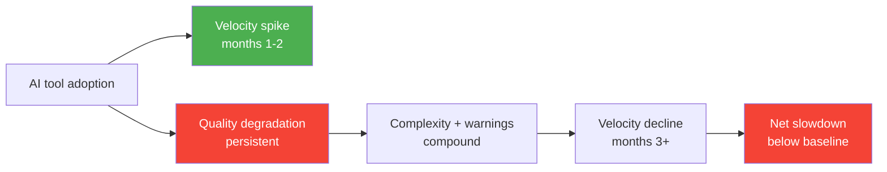

# The Velocity-Quality Asymmetry

> AI coding tools produce a burst of speed that fades within months, while the quality debt they introduce compounds indefinitely. Sustainable velocity requires treating QA investment as a prerequisite, not an afterthought.

## The Evidence

A causal study of 806 Cursor-adopting repositories versus 1,380 matched controls reveals an asymmetry between velocity gains and quality costs ([He et al., MSR 2026](https://arxiv.org/abs/2511.04427)):

| Metric | Effect | Duration |
|--------|--------|----------|
| Lines added | +281% | Month 1 only — fades by month 3 |
| Commits | +55% | Month 1 only |
| Static analysis warnings | +30% | Persistent (6+ months) |
| Code complexity | +42% | Persistent (6+ months) |

The velocity spike is real but transient. The quality degradation is real and persistent. This is not a trade-off — it is an asymmetry.

## The Feedback Loop

Quality debt does not just accumulate — it actively destroys future velocity. Panel GMM estimation from the same study quantifies the mechanism:

- A **100% increase in code complexity** causes a **64.5% decrease** in subsequent lines added
- A **100% increase in static analysis warnings** causes a **50.3% decrease** in subsequent velocity

The initial velocity gain is fully cancelled out by approximately a 5x increase in static warnings or a 3x increase in complexity. Teams that adopt AI tools without scaling QA end up slower than they started.

## Why It Happens

The study identifies a direct complexity effect: even controlling for codebase growth, AI tool adoption increases code complexity by ~9% independently. The hypothesized mechanism is multi-file edits introducing architectural inconsistencies — generated code that is locally correct but structurally incoherent. [unverified: the paper measures the effect but does not directly observe the architectural mechanism]

Independent data corroborates the pattern:

- AI-generated code produces **1.7x more bugs** than human code, with 75% more logic and correctness errors per PR ([CodeRabbit Report](https://www.coderabbit.ai/blog/state-of-ai-vs-human-code-generation-report))
- AI adoption increases PR size by ~18%, incidents per PR by ~24%, and change failure rate by ~30% ([Osmani, The 80% Problem](https://addyo.substack.com/p/the-80-problem-in-agentic-coding))

## The QA Scaling Workflow

Capturing the velocity benefit without accruing the debt requires scaling verification proportionally to output volume.

### Phase 1: Automated Quality Gates (Before Merge)

Deploy deterministic checks that run on every AI-generated change:

1. **Static analysis** — linters, type checkers, complexity thresholds that block merges above a ceiling
2. **Test coverage gates** — AI-generated code must meet the same coverage requirements as human code
3. **Complexity budgets** — set per-PR cognitive complexity limits; reject changes that increase complexity without justification

These gates are non-negotiable. See [Deterministic Guardrails Around Probabilistic Agents](../verification/deterministic-guardrails.md) for implementation patterns.

### Phase 2: Scaled Code Review

Traditional review cannot absorb AI-era output volume. Restructure review around the bottleneck:

- **AI-first review pass** — route mechanical checks (style, correctness, boundary conditions) to an agent reviewer. Anthropic's Code Review system raised substantive review coverage from 16% to 54% of changes with <1% false positive rate ([TechCrunch, March 2026](https://techcrunch.com/2026/03/09/anthropic-launches-code-review-tool-to-check-flood-of-ai-generated-code/))
- **Human review for architecture** — reserve human attention for design decisions, intent alignment, and cross-module coherence. This is where the complexity debt originates and where humans still outperform agents
- **Tiered routing** — non-critical code merges after AI-only review; critical code escalates to mandatory human review. See [Tiered Code Review](../code-review/tiered-code-review.md)

### Phase 3: Continuous Quality Monitoring

Track quality metrics alongside velocity metrics at the project level:

- Static analysis warning trend (should be flat or declining)
- Cognitive complexity per module (set a ceiling, alert on drift)
- Change failure rate (incidents per merged PR)
- Review coverage (percentage of changes receiving substantive feedback)

If quality metrics trend upward, slow down. The velocity gain is not worth it if it reverses within two months.

## The Adoption Window

The first two months after AI tool adoption are a critical window. Teams experience peak velocity while quality processes have not yet adapted. This is where most of the technical debt originates.

Use this window deliberately:

1. **Do not celebrate the velocity spike** — it is transient by default
2. **Invest the freed time in QA infrastructure** — automated gates, agent reviewers, complexity monitoring
3. **Set a complexity baseline before adoption** — you cannot detect drift without a starting point
4. **Review AI-generated multi-file changes with extra scrutiny** — this is where architectural inconsistencies enter

## Key Takeaways

- Velocity gains from AI coding tools last ~2 months without QA investment; quality degradation persists indefinitely
- Quality debt actively reverses velocity gains through a measured causal mechanism
- The solution is not to avoid AI tools — it is to scale QA proportionally to output volume
- Treat the adoption window as a QA investment period, not a productivity celebration

## Related

- [Verification-Centric Development](verification-centric-development.md) — the verification pipeline design that makes AI-generated code production-viable
- [Agent PR Volume vs. Value](../code-review/agent-pr-volume-vs-value.md) — empirical merge rate data showing volume does not equal value
- [Deterministic Guardrails Around Probabilistic Agents](../verification/deterministic-guardrails.md) — implementation patterns for automated quality gates
- [Tiered Code Review](../code-review/tiered-code-review.md) — routing review effort by risk level
- [The 80% Problem](https://addyo.substack.com/p/the-80-problem-in-agentic-coding) — Osmani on bottleneck migration from writing to verification

## Unverified Claims

- The hypothesis that multi-file edits are the primary mechanism for AI-induced complexity increase is proposed but not directly observed in the He et al. study
- The ~9% direct complexity effect (independent of codebase growth) has not been replicated outside the original study
