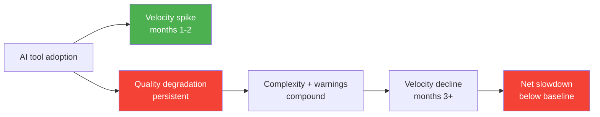

# Velocity-Quality Asymmetry: Why AI Speed Gains Fade

> AI coding tools deliver a velocity burst that fades within months while their quality debt compounds indefinitely, so sustainable speed demands QA investment up front.

Related lesson: [Garbage-Collecting Entropy](https://learn.agentpatterns.ai/workflows/garbage-collecting-entropy/) covers this concept in a hands-on lesson with quizzes.

## The evidence

A causal study of 806 Cursor-adopting repositories against 1,380 matched controls shows an asymmetry between velocity gains and quality costs ([He et al., MSR 2026](https://arxiv.org/abs/2511.04427)):

| Metric | Effect | Duration |
|--------|--------|----------|
| Lines added | +281% | Month 1 only — fades by month 3 |
| Commits | +55% | Month 1 only |
| Static analysis warnings | +30% | Persistent (6+ months) |
| Code complexity | +42% | Persistent (6+ months) |

The velocity spike is real but transient. The quality degradation is real and persistent. This is not a trade-off. It is an asymmetry.

## The feedback loop

Quality debt does not just accumulate. It destroys future velocity. Panel GMM estimation from the same study measures the mechanism:

- A 100% increase in code complexity causes a 64.5% decrease in subsequent lines added
- A 100% increase in static analysis warnings causes a 50.3% decrease in subsequent velocity

A 5x increase in static warnings, or a 3x increase in complexity, cancels the initial velocity gain. Teams that adopt AI tools without scaling QA end up slower than they started.


```mermaid
graph LR
    A[AI tool adoption] --> B[Velocity spike<br/>months 1-2]
    A --> C[Quality degradation<br/>persistent]
    C --> D[Complexity + warnings<br/>compound]
    D --> E[Velocity decline<br/>months 3+]
    E --> F[Net slowdown<br/>below baseline]

    style B fill:#4caf50,color:#fff
    style C fill:#f44336,color:#fff
    style F fill:#f44336,color:#fff
```

## Why it happens

The study finds a direct complexity effect. Even controlling for codebase growth, AI tool adoption raises code complexity by about 9% on its own ([He et al., MSR 2026](https://arxiv.org/abs/2511.04427)). The paper measures this effect statistically but does not directly observe the architectural mechanism. The authors suggest that multi-file edits introduce architectural inconsistencies: generated code that is locally correct but structurally incoherent.

Independent data backs up the pattern:

- AI-generated code produces 1.7x more bugs than human code, with 75% more logic and correctness errors per PR ([CodeRabbit Report](https://www.coderabbit.ai/blog/state-of-ai-vs-human-code-generation-report))
- AI adoption raises PR size by about 18%, incidents per PR by about 24%, and change failure rate by about 30% ([Osmani, The 80% Problem](https://addyo.substack.com/p/the-80-problem-in-agentic-coding))

## The QA scaling workflow

To capture the velocity benefit without the debt, scale verification in proportion to output volume.

### Phase 1: automated quality gates before merge

Run deterministic checks on every AI-generated change:

1. Static analysis: linters, type checkers, and complexity thresholds that block merges above a ceiling.
2. Test coverage gates: AI-generated code must meet the same coverage requirements as human code.
3. Complexity budgets: set per-PR cognitive complexity limits and reject changes that raise complexity without justification.

These gates are non-negotiable. See [Deterministic Guardrails Around Probabilistic Agents](../verification/deterministic-guardrails.md) for implementation patterns.

### Phase 2: scaled code review

Traditional review cannot absorb AI-era output volume. Restructure review around the bottleneck:

- AI-first review pass: route mechanical checks (style, correctness, boundary conditions) to an agent reviewer. Anthropic's Code Review system raised substantive review coverage from 16% to 54% of changes with under 1% false positive rate ([TechCrunch, March 2026](https://techcrunch.com/2026/03/09/anthropic-launches-code-review-tool-to-check-flood-of-ai-generated-code/))
- Human review for architecture: reserve human attention for design decisions, intent alignment, and cross-module coherence. This is where the complexity debt starts and where humans still outperform agents
- Tiered routing: non-critical code merges after AI-only review, while critical code escalates to mandatory human review. See [Tiered Code Review](../code-review/tiered-code-review.md)

### Phase 3: continuous quality monitoring

Track quality metrics alongside velocity metrics at the project level:

- Static analysis warning trend (should be flat or declining)
- Cognitive complexity per module (set a ceiling, alert on drift)
- Change failure rate (incidents per merged PR)
- Review coverage (percentage of changes receiving substantive feedback)

If quality metrics trend upward, slow down. The velocity gain is not worth it if it reverses within two months.

## The adoption window

The first two months after AI tool adoption are a critical window. Teams hit peak velocity while quality processes have not yet adapted. This is where most of the technical debt starts.

Use this window deliberately:

1. Do not celebrate the velocity spike. It is transient by default.
2. Invest the freed time in QA infrastructure: automated gates, agent reviewers, and complexity monitoring.
3. Set a complexity baseline before adoption. You cannot detect drift without a starting point.
4. Review AI-generated multi-file changes with extra care. This is where architectural inconsistencies enter.

## When this backfires

The QA-scaling advice is strongest for long-lived production codebases. It weakens or reverses in three cases:

- [Throwaway prototypes and spikes](throwaway-prototype-skill.md): code slated for deletion within weeks does not build up debt that matters. Imposing complexity budgets and coverage gates on exploratory work wastes the velocity windfall the tooling gives you.
- Small teams without review capacity: if a two-person team cannot staff either human reviewers or an agent-reviewer pipeline, mandatory quality gates become a merge bottleneck that erases the velocity gain before the quality debt would have. The better response may be to [limit AI-generated code volume](../code-review/agent-pr-volume-vs-value.md) rather than scale QA.
- Early-stage products seeking product-market fit: shipping the wrong feature fast is often cheaper than shipping the right feature correctly. Teams whose main risk is building something nobody wants may reasonably accept the quality debt in exchange for faster learning cycles, then pay it down once the product direction settles.

The underlying asymmetry still holds: velocity fades by month 3 and debt compounds. The question is whether compounding debt is a problem on your timeline. For short-horizon work it may not be.

## Example

A team adopting Cursor adds quality gates to their CI pipeline in the first week. Their GitHub Actions workflow enforces complexity budgets and static analysis thresholds on every PR:

```yaml
# .github/workflows/quality-gate.yml
name: Quality Gate
on: [pull_request]

jobs:
  complexity-budget:
    runs-on: ubuntu-latest
    steps:
      - uses: actions/checkout@v4
      - name: Check cognitive complexity
        run: |
          # Fail if any function exceeds complexity threshold
          npx eslint --rule '{"complexity": ["error", 15]}' \
            --no-eslintrc --ext .ts,.js src/
      - name: Check file-level complexity delta
        run: |
          # Compare complexity against main branch baseline
          BASE=$(git diff --name-only origin/main...HEAD -- '*.ts' '*.js')
          for f in $BASE; do
            npx cr --threshold 25 "$f" || exit 1
          done

  static-analysis:
    runs-on: ubuntu-latest
    steps:
      - uses: actions/checkout@v4
      - name: Block on new warnings
        run: |
          # Capture warning count on main
          git stash
          BASELINE=$(npx eslint src/ --format json | jq '[.[].errorCount] | add')
          git stash pop
          CURRENT=$(npx eslint src/ --format json | jq '[.[].errorCount] | add')
          if [ "$CURRENT" -gt "$BASELINE" ]; then
            echo "::error::Static analysis warnings increased from $BASELINE to $CURRENT"
            exit 1
          fi
```

The team tracks three metrics weekly in a shared dashboard:

| Metric | Week 1 baseline | Week 4 | Week 8 | Trend |
|--------|----------------|--------|--------|-------|
| Static analysis warnings | 142 | 138 | 131 | Declining |
| Avg cognitive complexity | 12.3 | 12.1 | 11.8 | Declining |
| Change failure rate | 8% | 7% | 6% | Declining |

By spending the velocity windfall on QA infrastructure in weeks 1 to 2, the team keeps the productivity gain through month 3 instead of losing it to compounding complexity.

## Key Takeaways

- Velocity gains from AI coding tools last ~2 months without QA investment; quality degradation persists indefinitely
- Quality debt actively reverses velocity gains through a measured causal mechanism
- The solution is not to avoid AI tools — it is to scale QA proportionally to output volume
- Treat the adoption window as a QA investment period, not a productivity celebration

## Related

- [Verification-Centric Development](verification-centric-development.md) — the verification pipeline design that makes AI-generated code production-viable
- [Agent PR Volume vs. Value](../code-review/agent-pr-volume-vs-value.md) — empirical merge rate data showing volume does not equal value
- [Deterministic Guardrails Around Probabilistic Agents](../verification/deterministic-guardrails.md) — implementation patterns for automated quality gates
- [Tiered Code Review](../code-review/tiered-code-review.md) — routing review effort by risk level
- [The 80% Problem](https://addyo.substack.com/p/the-80-problem-in-agentic-coding) — Osmani on bottleneck migration from writing to verification
- [The Bottleneck Migration](../human/bottleneck-migration.md) — review becomes the new bottleneck as code generation gets cheaper
- [TDD Interaction Models: Throughput Versus Test Quality](tdd-interaction-models.md) — the same trade seen at the level of a single TDD cycle
