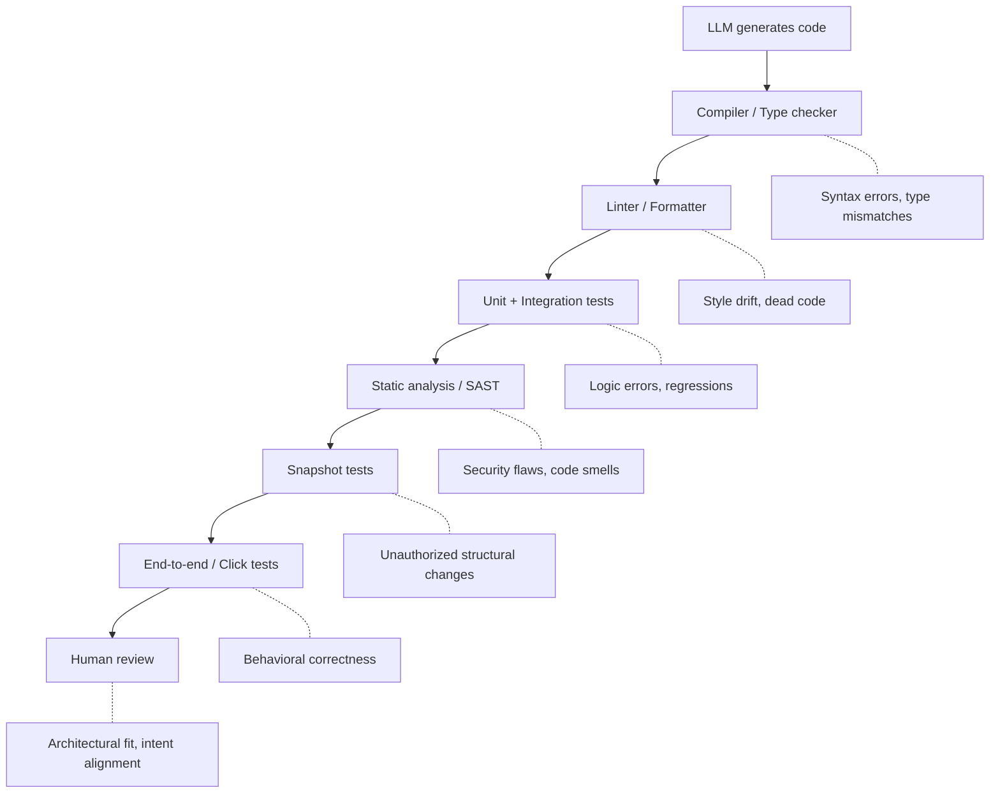

# Verification-Centric Development for AI-Generated Code

> Verification-centric development moves the developer's value from writing code to proving generated code is correct.

Related lesson: [Becoming a Tech Lead](https://learn.agentpatterns.ai/workflows/becoming-a-tech-lead/) covers this concept in a hands-on lesson with quizzes.

LLMs generate implementation code faster than developers can write it. The bottleneck is no longer authorship. It is verification. As the framing goes: Software 1.0 is software you specify; Software 2.0 is software you verify. Production-grade AI-assisted development invests in planning, architecture, and layered automated checks rather than manual code creation.

This is the production-scale counterpart to [vibe coding](../patterns/anti-patterns/vibe-coding.md). Where vibe coding skips understanding entirely for throwaway work, verification-centric development builds systematic proof that generated code is correct, secure, and maintainable.

## The proof point

TextForge, a desktop application with ~100% LLM-generated code, passed a CASA2 security audit — Google's Cloud Application Security Assessment standard. The developers credit this entirely to rigorous planning, testing, and verification, not to the quality of raw LLM output ([Stannard, TextForge case study](https://aaronstannard.com/software-2.0-case-study-textforge/)).

The raw output was not production-ready. Initial LLM-authored tests were "anemic" — they hit coverage metrics without meaningful validation. The code needed integration tests and browser automation before the test suite caught real defects.

## The verification pipeline

Each layer catches a different failure class. No single layer is sufficient.


```mermaid
graph TD
    A[LLM generates code] --> B[Compiler / Type checker]
    B --> C[Linter / Formatter]
    C --> D[Unit + Integration tests]
    D --> E[Static analysis / SAST]
    E --> F[Snapshot tests]
    F --> G[End-to-end / Click tests]
    G --> H[Human review]

    B -.- B1["Syntax errors, type mismatches"]
    C -.- C1["Style drift, dead code"]
    D -.- D1["Logic errors, regressions"]
    E -.- E1["Security flaws, code smells"]
    F -.- F1["Unauthorized structural changes"]
    G -.- G1["Behavioral correctness"]
    H -.- H1["Architectural fit, intent alignment"]
```

Snapshot testing deserves special attention. In the TextForge project, snapshot tests (using the Verify library) caught "scores of unauthorized changes" in LLM output ([Stannard, TextForge case study](https://aaronstannard.com/software-2.0-case-study-textforge/)). Each snapshot produces a git-trackable approval file, so the developer must explicitly approve any structural change. This prevents the silent regressions that happen when LLMs modify code outside the requested scope.

!!! warning "Anchor to deterministic signals"
    Reflection loops must verify against [deterministic signals](../verification/deterministic-guardrails.md) — compiler output, test results, lint errors, schema validation. Model self-critique ("let me check if that's correct") is not verification. The model that generated the bug cannot reliably detect it through introspection.

## Planning is the highest-value activity

> Most developers who get bad results with AI usually do so because they skip the most important part: planning mode.

Planning has always mattered. LLMs raise the cost of skipping it. A missing architectural decision that a human developer would catch mid-implementation becomes a structural flaw [replicated across dozens of generated files](../patterns/anti-patterns/pattern-replication-risk.md) before anyone notices.

Effective planning for LLM-assisted development includes:

- Architecture documents that define module boundaries, data flow, and permitted dependencies
- Detailed specs for each task before prompting — inputs, outputs, constraints, edge cases
- Architectural patterns (vertical slices, clean architecture) that keep the codebase tractable for future AI assistance
- Constrained solution spaces — enforced boundaries and standardized structures that trade flexibility for reliability

## The verification gap

The infrastructure works, but only if developers actually use it. Current evidence shows a dangerous gap:

- Only 48% of developers consistently check AI-assisted code before committing ([Osmani, "The 80% Problem"](https://addyo.substack.com/p/the-80-problem-in-agentic-coding))
- 38% find reviewing AI logic harder than reviewing human code ([Osmani](https://addyo.substack.com/p/the-80-problem-in-agentic-coding))
- [Comprehension debt](../patterns/anti-patterns/comprehension-debt.md) accumulates: developers grow comfortable approving code they could no longer write independently, which leads to rubber-stamp reviews

Martin Fowler's team calls this rigor relocation: quality assurance shifts from code authorship to environment design, feedback loops, and control systems, an emerging discipline known as [harness engineering](../patterns/agent-design/harness-engineering.md) ([Fowler, harness engineering](https://martinfowler.com/articles/exploring-gen-ai/harness-engineering.html)). The developer who once ensured quality by writing careful code now ensures quality by building careful verification infrastructure.

This relocation is not free. Structural linting and architectural constraints prove conformance but do not prove [behavioral correctness](../verification/behavioral-testing-agents.md). The verification pipeline reduces risk; it does not eliminate it.

## When this backfires

A reasonable practitioner could defend the opposite recommendation in specific contexts. Verification-centric development is worse than lighter-weight alternatives when:

- The risk budget is smaller than the verification investment. Throwaway scripts, one-off migrations, and exploratory prototypes do not justify snapshot suites, SAST pipelines, and architectural decision records. [Vibe coding](../patterns/anti-patterns/vibe-coding.md) is the correct mode for that end of the spectrum.
- Verifiers themselves are unreliable. LLM-based verifiers miss defects at a much higher rate than deterministic tooling, and even benchmark-grade test suites can overestimate solution quality — 20 to 40% of LeetCode problems that passed LiveCodeBench's private tests still failed on the online judge ([Ma et al., "Rethinking Verification for LLM Code Generation"](https://arxiv.org/abs/2507.06920v2)). Treat any verifier as a fallible signal, not a proof of correctness.
- Snapshot tests encode the wrong baseline. Verify-style approval tests lock in whatever structure the first reviewer approved. If that initial approval was sloppy, every later diff is compared against a flawed reference and [scope-creep checks](../patterns/anti-patterns/pr-scope-creep-review-bottleneck.md) become noise.
- Process load crowds out thinking. Teams that add ceremony (plans, specs, approval steps) without pruning existing review steps slow down without catching proportionally more bugs. The pipeline should replace manual checks, not stack on top of them.

## Model routing

Not every task needs your most expensive model. Route by complexity:

| Task type | Model tier | Rationale |
|-----------|-----------|-----------|
| Boilerplate, CRUD, [pattern replication](../patterns/anti-patterns/pattern-replication-risk.md) | Cheaper / faster | Low novelty, high predictability |
| Refactoring with clear specs | Mid-tier | Moderate complexity, constrained scope |
| Novel architecture, security-sensitive | Most capable | High stakes, needs strongest reasoning |

This preserves tokens and context budget for the tasks where model capability actually matters.

## Example

A team is building a REST API with authentication. Instead of prompting an agent and accepting whatever emerges:

1. Plan. Write a spec defining endpoints, auth flow, data models, and error handling. Document which patterns to follow (for example, vertical slice architecture, repository pattern for data access).

2. Generate. Prompt the agent with the spec and architectural constraints. Use a capable model for the auth module, a cheaper model for [CRUD endpoints](../patterns/anti-patterns/pattern-replication-risk.md).

3. Verify in layers.

```bash
# Automated pipeline runs on every generation
dotnet build          # Compiler catches type errors
dotnet format --check # Formatter catches style drift
dotnet test           # Tests catch logic errors
semgrep --config auto # SAST catches security patterns

# Snapshot tests require explicit approval for structural changes
dotnet test --filter "Category=Snapshot"
# Any diff in .verified files must be manually reviewed and approved
```

4. Review the delta. The developer reviews only what the automated layers could not catch: does the generated code fit the architecture? Does it handle the edge cases the spec defined? Does the auth flow match the threat model?

## Key Takeaways

- The developer's highest-value contribution shifts from writing code to designing verification systems — planning, specs, quality gates, and architectural constraints
- Layer automated checks so each catches a different failure class: compiler, linter, tests, static analysis, snapshot tests, end-to-end tests, human review
- Snapshot testing prevents silent scope creep in LLM output by requiring explicit approval of structural changes
- Planning is the most commonly skipped and highest-leverage step — LLMs amplify the cost of missing architecture decisions
- [Comprehension debt](../patterns/anti-patterns/comprehension-debt.md) is the primary risk: verification-centric development is powerful but dangerous if developers stop understanding what they approve

## Related

- [Vibe Coding: Outcome-Oriented Development](../patterns/anti-patterns/vibe-coding.md) — the casual, low-risk end of the same spectrum
- [The Plan-First Loop: Design Before Code](plan-first-loop.md)
- [Incremental Verification](../verification/incremental-verification.md)
- [Rigor Relocation](../human/rigor-relocation.md)
- [Spec-Driven Development](spec-driven-development.md)
- [Entropy Reduction Agents](entropy-reduction-agents.md)
