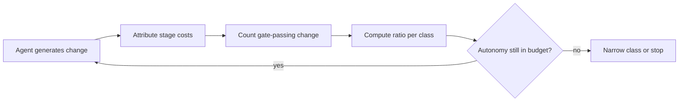

# Measuring the Verification Tax on Agent Output

> The Verification Tax divides CI, review, security, and rework cost by generation cost, and the ratio diagnoses rather than targets.

Measure it per change class, only where per-stage cost is already collected, and never as a score for a person or a team. Outside those conditions the number is an accounting artifact. Inside them it answers what the model bill cannot: whether the money spent proving an agent's change is safe buys reliability, or covers for a weak generator.

## The measurement problem

Commit counts stopped meaning much once an agent could produce them at will. Happy Bhati lists the failures in order: "Lines of code are easy to inflate. Commits can be split or merged. Pull-request count can rise because an agent produces many small changes." The arithmetic behind that is specific. A 2026 study of more than 100,000 GitHub developers found a cumulative increase in coding activity from autonomous agents of "180% at the commit level" that "fell to 50% at the project level and 30% at actual releases". Bhati summarizes what that study's authors concluded from it: "The authors describe a weak-link production structure: writing code accelerates faster than the human and organizational stages needed to turn changes into shipped software" ([Bhati, arXiv:2609.04681v1](https://arxiv.org/abs/2609.04681v1)).

Google's 2025 DORA report reaches the same shape from survey data. It finds "a positive relationship between AI adoption on both software delivery throughput and product performance", and in the same breath that "AI adoption does continue to have a negative relationship with software delivery stability", because "an increase in change volume leads to instability" without strong automated testing and fast feedback ([Google Cloud, 2025](https://cloud.google.com/blog/products/ai-machine-learning/announcing-the-2025-dora-report)).

Both readings point at the same missing number. The cost of moving a change through the gates is invisible in the token bill and invisible in the commit graph, so it goes unmanaged in the one place it is growing. [The velocity-quality asymmetry](velocity-quality-asymmetry.md) documents the symptom on a different dataset. The ratio below is what puts a number on it.

## Three implementation layers

### Layer 1: attribute the four downstream costs

Bhati defines the ratio for a set of agent-generated candidate changes as `V_tax = (C_CI + C_review + C_security + C_rework) / C_generation`, where "C_generation includes model, context, and agent execution cost" ([arXiv:2609.04681v1](https://arxiv.org/abs/2609.04681v1)). Rework is the bucket that goes missing, and it sits in the half of the bill nobody reads: "The direct model bill is easy to see. The rest is distributed across context construction, repeated attempts, tool calls, sandboxes, CI minutes, security scans, reviewer attention, rework, incidents, and the infrastructure required to observe all of it."

Attribute each bucket to a change class rather than to an individual pull request. Bhati's own cost taxonomy carries the caveat: it is "not a claim that every organization can perfectly allocate every term to an individual pull request. Its value is to prevent optimization of the easiest visible number while downstream cost grows unnoticed" ([arXiv:2609.04681v1](https://arxiv.org/abs/2609.04681v1)). The class is the level at which the gate set is constant, so it is the coarsest unit that still answers the question.

Reviewer time is the bucket with a published anchor. Bhati reports that Google sees "about 60 minutes of active author shepherding time between sending a change for review and submitting it", which gives a defensible starting figure when your own review telemetry is thin ([arXiv:2609.04681v1](https://arxiv.org/abs/2609.04681v1)).

### Layer 2: count output after the gates, not before

The denominator of any delivery metric has to survive an agent producing many small changes. Bhati's unit is the Production-Qualified Change: "A candidate change i receives PQC credit only if it satisfies the organization's relevant qualification vector", written `PQC_i = ∏_{g∈G_i} 1{g(i)=pass}` over the gate set required for that change class ([arXiv:2609.04681v1](https://arxiv.org/abs/2609.04681v1)). A documentation edit carries a small gate set. A migration or an authentication change carries a large one, and it earns credit only once every gate in it passes.

Counting this way makes the two halves of the ratio commensurate. Generation cost is spent per attempt; qualified output accrues per survivor. [Cost-quality Pareto measurement](../token-engineering/cost-quality-pareto-measurement.md) does the same job for a single agent configuration, plotting cost against quality so a downgrade shows as a drop off the frontier rather than a smaller bill.

### Layer 3: bind the ratio to an autonomy decision

A ratio nobody spends is telemetry, not control. Bhati treats autonomy as a budgeted privilege rather than a capability level: each task consumes a money and compute budget, a reliability and risk budget, and a human-attention budget, and the rule is to "increase autonomy only if all three budgets remain within policy" ([arXiv:2609.04681v1](https://arxiv.org/abs/2609.04681v1)). The Verification Tax is the reading that tells you which of the three you are about to breach. A class whose ratio climbs while its qualified-change rate holds is consuming reviewer capacity, not compute.

The stop rule sits in the same layer. Bhati is blunt about long-horizon runs: "Long-horizon agents need token/time ceilings and progress checkpoints. Unlimited iteration is not autonomy; it is an unbounded variable bill."

## Triggers and constraints

Compute the ratio on a schedule, per change class, over a window wide enough that one incident does not set it. Recompute on a policy change, a model swap, or a harness change, since all three move the denominator without touching the gates.

The practice is tool-agnostic. The buckets are CI minutes, reviewer hours, security scanning, and rework, and none of them depend on which assistant produced the change.

One constraint outranks the rest: the ratio has no good direction to move in. Bhati states it directly. "The goal is not 'minimize verification.' A low Verification Tax can be dangerous if it results from skipping tests or rubber-stamping reviews. The useful objective is to reduce verification cost for a fixed reliability target, or improve reliability for a fixed assurance budget." Fix one side before moving the other. A ratio that fell because reviewers started approving faster records a drop in assurance, and the chart cannot tell you which of the two happened.

## Why it works

Delivery is a weak-link chain, so a metric taken before the constrained stage measures the stage that is not constrained. That is the whole mechanism: commit-level counting samples the part that got faster, which is why the attenuation above runs the direction it does. DORA supplies the same causal chain from an independent population, where higher change volume raises throughput and lowers stability at once ([Google Cloud, 2025](https://cloud.google.com/blog/products/ai-machine-learning/announcing-the-2025-dora-report)).

The ratio earns its place because it is ambiguous on purpose. Bhati lists five things a high reading can mean: the task is inherently high risk and deserves expensive assurance, the chosen model or context is producing weak candidates, the agent is working beyond its reliability envelope, the test and review infrastructure is inefficient or overloaded, or policy requires redundant evidence without reducing risk ([arXiv:2609.04681v1](https://arxiv.org/abs/2609.04681v1)). Each cause has a different fix, and each fix is expensive. The number does not choose for you. It narrows five candidates to the one your qualified-change rate and reviewer telemetry can distinguish, which is more than a token bill does.

## When this backfires

- Low change volume. With a handful of qualified changes a month, one incident's rework dominates the numerator and the ratio swings by an order of magnitude between quarters. Bhati says as much: the ratio "is not expected to be stable across repositories or task types."
- Cross-team comparison. CI capacity, scanning subscriptions, and reviewer salaries are largely shared fixed costs, so per-change attribution is an allocation policy. Two defensible allocations produce two different ratios, and a dashboard invites exactly the comparison they cannot support.
- Promotion from diagnostic to target. Driving the number down rewards thinner tests and faster approvals, which is the failure Bhati names.
- Use as an individual score. Bhati's own warning: Production-Qualified Change "must not become an individual developer productivity score; doing so could encourage gaming and penalize engineers who work on difficult, high-risk systems." Engineers on high-blast-radius systems carry larger gate sets by design and would score worst.
- Safety-critical and regulated work. Verification already dominates cost there by intent and is already accounted for under compliance. A high ratio is the correct state, and the measurement adds a second set of books with no decision attached.

The strongest case against building this at all is the instrumentation bill. Splitting cost into four buckets per change class needs telemetry most teams do not have, and that engineering time could go straight into the automated gates the ratio would tell them to build. The constructs are also young. Bhati says so: Production-Qualified Change, Verification Tax, and the autonomy budget "are not claimed as validated standards. They are hypotheses intended to make future studies comparable." Treat the practice as a hypothesis you are testing on your own delivery system, not a standard you are adopting.

## Example

The decision point the measurement feeds is a marginal one, and Bhati puts numbers on both sides of it: "If the next US$10 of model inference avoids an hour of expert work and does not raise risk, it is likely worthwhile. If the next US$100 of retries creates a larger patch that still needs the same expert review, the agent has not created equivalent value" ([arXiv:2609.04681v1](https://arxiv.org/abs/2609.04681v1)).

Read against the layers, the second case has a signature you can see before the invoice. Generation cost rises across retries, qualified-change count for the class stays flat, and reviewer hours per qualified change hold steady or climb. The ratio goes up with no reliability bought. That is the reading that should trip the Layer 3 stop rule rather than a longer run.

## Key Takeaways

- Attribute CI, review, security, and rework cost per change class; rework is the bucket that goes uncounted, because it never reaches the model bill.
- Count output as gate-passing change, not commits or pull requests, so the denominator survives an agent producing many small diffs.
- A high ratio has five candidate causes, each with a different fix, so treat the reading as a prompt to diagnose rather than an instruction to cut.
- Give the ratio a decision to feed: a class whose cost climbs while qualified output holds flat is spending reviewer capacity and should lose autonomy, not gain a longer token ceiling.
- Keep it off individual dashboards and out of cross-team comparisons; the allocation choices underneath it do not survive either use.

## Related

- [The Velocity-Quality Asymmetry: Why AI Speed Gains Fade Without QA Investment](velocity-quality-asymmetry.md) — the empirical symptom this measurement is built to detect
- [Verification Capacity Saturation: Three Levers, One Default](../verification/verification-capacity-saturation.md) — the response set once the checking station is the constraint
- [Per-Task Verification Budget: Size the Task to Fit the Check](per-task-verification-budget.md) — the human-attention budget expressed as a per-task admission rule
- [Cost-Quality Pareto Measurement for Agent Configurations](../token-engineering/cost-quality-pareto-measurement.md) — the same cost-against-quality frame applied to one agent configuration
- [Intervention Rate as a Diagnostic North Star, Not a Target](../human/intervention-rate-diagnostic-north-star.md) — a sibling metric governed by the same diagnostic-not-target rule
- [Reducing Fixed CI Overhead Before Adding Shards](ci-setup-overhead-before-sharding.md) — the CI half of the tax, and the lever that moves it
