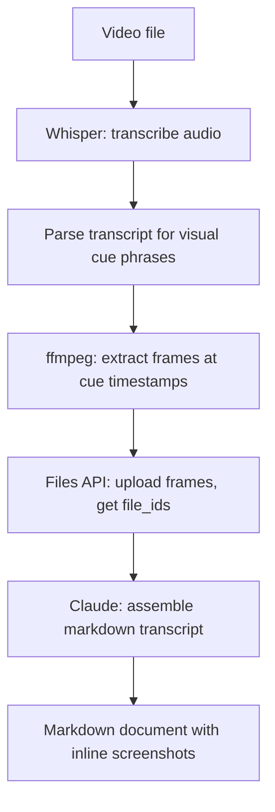

# Video Transcript Skill: Meeting Recording to Markdown with Inline Screenshots

> Orchestrate Whisper, ffmpeg, and the Files API to convert a meeting recording into a searchable, skimmable markdown document — with screenshots inserted where the speaker says "as you can see" or "look at this."

Recordings are poor knowledge artifacts: unsearchable, non-linkable, and impossible to skim. A structured transcript with visual anchors at key moments turns the same content into documentation that can be indexed, shared as a decision record, or used for onboarding — without manual editing.

## Why This Is a Multi-Tool Problem

Claude has no native audio or video ingestion. The Files API accepts PDF, images (JPEG, PNG, GIF, WebP), and plain text only. Audio and video must be externally processed before Claude can work with the content.

The full pipeline requires three tools Claude does not provide natively:

| Step | Tool | Output |
|---|---|---|
| Audio transcription | Whisper (cloud or local) | Text with word-level timestamps |
| Frame extraction | ffmpeg | PNG images at target timestamps |
| Image hosting for multi-step assembly | Files API | Persistent `file_id` references |

This is what makes it a skill build, not a one-shot prompt.

## Pipeline Architecture



Each step is a separate tool call. The skill orchestrates them in sequence.

## Skill Definition

Save this at `.claude/skills/video-transcript.md`:

```markdown
---
name: video-transcript
description: Convert a meeting recording to a markdown transcript with inline screenshots at visual-cue moments. Input: path to a video file (MP4, MOV, MKV). Output: markdown file saved alongside the source video.
tools: Bash, Read, Write
model: sonnet
context: fork
---

You convert a video recording to a markdown transcript with inline screenshots.

Given: $VIDEO_PATH

Steps:
1. Extract audio: `ffmpeg -i "$VIDEO_PATH" -vn -ar 16000 -ac 1 "$VIDEO_PATH.wav"`
2. Transcribe: `whisper "$VIDEO_PATH.wav" --output_format json --word_timestamps true --output_dir /tmp/transcript/`
3. Parse the JSON transcript. Find all segments where the text contains visual cue phrases: "as you can see", "look at this", "here", "this part", "notice", "see how", "look here".
4. Cap at 20 cue matches to control cost. If more than 20 matches, take the 20 most evenly distributed by timestamp.
5. For each cue timestamp, extract a frame: `ffmpeg -i "$VIDEO_PATH" -ss {timestamp} -vframes 1 /tmp/transcript/frame_{n}.png`
6. Upload each frame via the Files API (see Files API usage below).
7. Assemble the markdown document: speaker-segmented transcript with each cue segment followed by its inline screenshot.
8. Derive output path from `$VIDEO_PATH`: same directory, same stem, with `-transcript.md` suffix. Write the output there.
```

## Files API Usage

The Files API requires the beta header shown below; check the [Files API docs](https://platform.claude.com/docs/en/docs/build-with-claude/files) for current availability status. Upload a frame by sending a multipart POST to the `/v1/files` endpoint:

```bash
curl -X POST "$ANTHROPIC_BASE_URL/v1/files" \
  -H "x-api-key: $ANTHROPIC_API_KEY" \
  -H "anthropic-version: 2023-06-01" \
  -H "anthropic-beta: files-api-2025-04-14" \
  -F "file=@/tmp/transcript/frame_0.png;type=image/png"
```

The response returns a `file_id`. Use it in the Claude API request as:

```json
{
  "type": "image",
  "source": {
    "type": "file",
    "file_id": "file_abc123"
  }
}
```

Files persist until explicitly deleted via the [Files API](https://platform.claude.com/docs/en/docs/build-with-claude/files). Using `file_id` references avoids re-uploading the same frame if the skill needs to retry the assembly step.

**Availability constraint**: The Files API requires the `anthropic-beta: files-api-2025-04-14` header and is not available on Amazon Bedrock or Google Vertex AI.

## Screenshot Density Control

Each uploaded image costs approximately 1,334 tokens at 1 megapixel (1000×1000 px), scaling to ~1,600 tokens at 1.19 megapixels — [the practical maximum](https://platform.claude.com/docs/en/docs/build-with-claude/vision) before Claude downsamples the image. A one-hour meeting with 60 visual cues would use ~80,000–96,000 tokens on images alone — before the transcript text.

Design decisions for density control:

| Scenario | Recommended cap | Rationale |
|---|---|---|
| Demo-heavy talk | 20 frames | Demos have frequent pointer gestures; cap by even distribution |
| Slide-heavy presentation | 10 frames | Slides change infrequently; capture slide transitions instead |
| Short standup (≤15 min) | No cap | Low frame count regardless |

The skill definition above hard-caps at 20 with even distribution. Adjust by passing a `--max-frames N` argument or by exposing it as a skill parameter.

For slide-heavy content, a better heuristic than cue-phrase matching is scene-change detection via ffmpeg:

```bash
ffmpeg -i "$VIDEO_PATH" -vf "select=gt(scene\,0.4),showinfo" -vsync vfr /tmp/transcript/slide_%04d.png
```

The `scene=0.4` threshold captures significant visual transitions (slide changes) rather than camera jitter.

## Transcript Output Format

```markdown
# Meeting Transcript: {filename}
**Date**: {date}
**Duration**: {duration}

---

## Summary

{Claude-generated 3-5 sentence summary}

---

## Transcript

**[00:00]** Speaker A: Welcome everyone. Today we're covering the deployment pipeline changes.

**[00:43]** Speaker B: The main issue we found was in the rollback step.

**[00:51]** Speaker B: As you can see, the timeout was set to 30 seconds which isn't enough for database migrations.


**[01:14]** Speaker A: Right, so we're proposing to make this configurable per-service.
```

Speaker labels require diarization (e.g., pyannote.audio). Without diarization, the transcript uses generic `[Speaker]` labels or omits labels entirely. Whisper alone does not identify speakers.

## Whisper Options

| Option | When to use |
|---|---|
| `openai/whisper` (cloud) | Quality-first; API key required |
| `mlx-whisper` | Apple Silicon, fast local inference |
| `whisper.cpp` | Cross-platform local; no Python dependency |
| `whisperfile` | Single-binary, no install required |

All produce JSON output with `--output_format json`. Word-level timestamps require `--word_timestamps true` (not all backends support this flag identically).

## `context: fork` Rationale

The `context: fork` field in the [skill frontmatter](../tool-engineering/skill-frontmatter-reference.md) isolates this skill in a forked conversation context. This is appropriate because:

- Media processing is long-running and generates large intermediate outputs
- Frame paths, file IDs, and transcript JSON should not accumulate in the main conversation context
- Failures (missing ffmpeg, Whisper not installed) should not corrupt the calling session's context

## Environment Prerequisites

The skill requires:

- `whisper` CLI accessible on `PATH` (or one of the local alternatives)
- `ffmpeg` on `PATH`
- `ANTHROPIC_API_KEY` set with Files API access
- Write access to a `/tmp/transcript/` scratch directory

Add a prerequisite check at the start of the skill:

```bash
command -v whisper >/dev/null 2>&1 || { echo "whisper not found"; exit 1; }
command -v ffmpeg >/dev/null 2>&1 || { echo "ffmpeg not found"; exit 1; }
```

## When This Backfires

This pipeline makes sense when you need programmable customization — cue-phrase detection, custom output formats, or integration with downstream Claude skills. It is the wrong choice when:

- **A native tool already exists**: Zoom, Teams, and Google Meet produce auto-transcripts with speaker labels without any installation. Otter.ai and rev.ai offer more accurate diarization than Whisper alone and handle the full pipeline as a service.
- **Token costs exceed the value**: A 60-frame, one-hour meeting consumes ~80–96k tokens just on images — before the transcript text. For large meeting libraries, costs accumulate quickly without aggressive frame capping.
- **The runtime environment is sandboxed**: CI systems and container environments often block `ffmpeg` and `whisper` CLI installs. The skill fails silently if prerequisites are absent without the guard check; verify the environment before deploying.
- **Audio quality is low**: Whisper transcription quality degrades sharply with background noise, heavy accents, or multiple simultaneous speakers. Without diarization, the output is a single-speaker stream regardless of how many participants spoke.

## Key Takeaways

- Claude has no native audio/video ingestion — Whisper is a hard dependency, not an optional enhancement
- ffmpeg handles both audio extraction and frame capture; it is the only tool needed for both steps
- Cap screenshot count before uploading; each image is ~1,334 tokens at 1 MP, up to ~1,600 tokens at the 1.19 MP practical maximum
- Use `file_id` references from the Files API to avoid re-uploading frames on retry
- `context: fork` is the right isolation pattern for long-running media pipelines
- Speaker diarization (pyannote.audio) is a separate step — visual cue phrase detection works without it
- The Files API beta header (`anthropic-beta: files-api-2025-04-14`) is required; Bedrock and Vertex AI are not supported

## Related

- [Introspective Skill Generation: Mining Agent Patterns](introspective-skill-generation.md)
- [On-Demand Skill Hooks](../tool-engineering/on-demand-skill-hooks.md)
- [Skill Library Evolution](../tool-engineering/skill-library-evolution.md)
- [Incident Log Investigation Skill](incident-log-investigation-skill.md)
- [Enterprise Skill Marketplace](enterprise-skill-marketplace.md)
- [Content Skills Audit](content-skills-audit.md)
