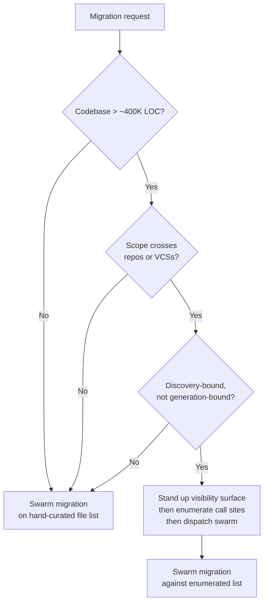

# Whole-Codebase Visibility as a Migration Prerequisite

> A scoping check that decides whether a large-scale agent migration fits in agentic search or needs whole-codebase visibility infrastructure first.

A locally-correct change that breaks the build globally is the failure shape that defines large-scale agent-driven migration. Sourcegraph frames the bottleneck this way: "the bottleneck in most large-scale migrations is not the engineers or the plan. It is that the tools cannot see the whole codebase" ([Sourcegraph, 2026-06-24](https://sourcegraph.com/blog/why-your-migration-tools-are-failing-your-engineers)). The visibility-as-prerequisite framing is a scoping decision that runs before any agent swarm — not a universal tool requirement.

## Why the prerequisite exists

Large-scale agent-driven migrations fail at the file the agent never opened, not the file it edited wrongly. CodeScaleBench (1,281 scored agent runs across 40+ repos in 9 languages) measured this directly: agents without code intelligence retrieved correct files 12.7% of the time; with Sourcegraph MCP, that rose to 27.7%, and Precision@5 climbed from approximately 0.007 to 0.47 on org-scale tasks ([Sourcegraph CodeScaleBench](https://sourcegraph.com/blog/codescalebench-testing-coding-agents-on-large-codebases-and-multi-repo-software-engineering-tasks)). The fix isn't a better model — it's giving the agent a deterministic, repository-wide view *before* the swarm dispatches. The prerequisite is the up-front check that decides whether that infrastructure is actually needed for the migration in front of you, or whether agentic search will do. The [Pattern Selection Map](../patterns/selection-map.md) treats blast radius and verification cost as the axes that decide where this kind of preparation pays off.

## Layer 1: Run the three-condition check

Three conditions must hold together. When any one fails, agentic search (grep, glob, read, iterate) is the cheaper default and the prerequisite is overhead.

1. The codebase exceeds roughly 400,000 lines of code. Below that threshold, "agents with only local tools (grep, file read, glob) begin to struggle systematically when codebases exceed roughly 400,000 lines" ([Sourcegraph, 2026-05](https://sourcegraph.com/blog/why-coding-agents-fail-large-codebases)); below it, the same tools suffice.
2. The migration scope crosses repositories, version control systems, or languages. CodeScaleBench measured a +0.209 F1 delta from code intelligence on multi-repo tasks against +0.085 on single-repo ([Sourcegraph CodeScaleBench](https://sourcegraph.com/blog/codescalebench-testing-coding-agents-on-large-codebases-and-multi-repo-software-engineering-tasks)). MathWorks' engineering spans "Perforce, GitHub, and GitLab, with a codebase built over forty-plus years. Their homegrown search tool only worked within Perforce" — a single-VCS search hid call sites the migration had to touch ([Sourcegraph, 2026-06-24](https://sourcegraph.com/blog/why-your-migration-tools-are-failing-your-engineers)).
3. The transformation is discovery-bound, not generation-bound. The hard task is enumerating every call site whose semantics change; applying the rewrite is easy once the list is exhaustive. Framework upgrades, API moves, security fixes, and dependency swaps fit this shape.

If all three hold, plan the migration around guaranteed-complete visibility before fanning out workers. If any one fails, [Swarm Migration Pattern](../patterns/multi-agent/swarm-migration-pattern.md) on a hand-curated file list is the cheaper route.

## Layer 2: Stand up the visibility surface

When the check binds, the orchestrator's next step is a visibility surface — a code-search index, a cross-repo MCP server, or an equivalent retrieval pass — established before any worker starts. Two practitioner primitives slot in here: [Cross-Repo Agent Search](../tool-engineering/cross-repo-agent-search.md) for org-scale discovery (with the 1,000-result GitHub cap as a saturation caveat) and [Indexed Regex Search for Agent Tools](../tool-engineering/indexed-regex-search-agent-tools.md) for a single large repo. Sourcegraph reports a Kubernetes-scale migration case where agents without code intelligence "timed out after two hours. With access to Sourcegraph's MCP tools, the same tasks completed in 89 seconds" ([Sourcegraph, 2026-06-24](https://sourcegraph.com/blog/why-your-migration-tools-are-failing-your-engineers)). The 89-second number is wall clock after the index supplied the file list, not retrieval quality on its own.

## Layer 3: Enumerate, then dispatch

Visibility produces a complete enumerated list of call sites. The orchestrator hands that list to the worker swarm, one worker per service or per file slice. Each worker's locally-correct output stays locally correct; what changes is the input — the worker now operates on a complete list rather than a discovered one. The handoff contract: visibility owns completeness, the swarm owns transformation. The [Sourcegraph Five failure patterns](../patterns/anti-patterns/large-codebase-agent-failure-patterns.md) page catalogues what happens when this boundary collapses and the worker is forced to discover its own list under pressure: Partial Completion ([Sourcegraph, 2026-05](https://sourcegraph.com/blog/why-coding-agents-fail-large-codebases)).

## The unseen-call-site failure mode

The defining signature of a visibility-bound migration: every edit the agent makes is correct against the files it saw; the migration breaks at a file the agent never opened. CodeScaleBench captured this as Partial Completion: "The baseline agent wasn't wrong about the files it found. Its changes were locally correct. It simply didn't find the other five files that needed to be changed" ([Sourcegraph, 2026-05](https://sourcegraph.com/blog/why-coding-agents-fail-large-codebases)). On a cross-file refactoring task in the Strata finance library, "the baseline agent modified 2 of 7 affected files and scored 0.32"; when structural retrieval surfaced the missing five files, the score rose to 0.80 ([Sourcegraph CodeScaleBench](https://sourcegraph.com/blog/codescalebench-testing-coding-agents-on-large-codebases-and-multi-repo-software-engineering-tasks)). The signature flips from technical to organisational at merge time: a passing PR that silently leaves four sibling services on the old contract is harder to detect than an obviously failing one. [Comprehension Debt](../patterns/anti-patterns/comprehension-debt.md) describes the downstream cost of that signature reaching production unnoticed.

## Why it works

Large-scale migrations are discovery-bound: the hard task is enumerating every call site whose semantics change, and once that list is exhaustive, applying the transformation is the easy part. Below ~400K LOC, the model's context plus naive search hold the working set implicitly. Above that, in multi-repo or cross-VCS scope, the working set exceeds what context plus naive search can carry, and the agent silently misses call sites. "Code intelligence moves that indexing outside the model — precomputed import graphs, symbol tables, and reference chains let it retrieve rather than search" ([Sourcegraph, 2026-05](https://sourcegraph.com/blog/why-coding-agents-fail-large-codebases)). The deeper principle is verified completeness over verified correctness — checking what the agent did *not* see, not just whether what it did see was right.

## When this backfires

- Single-repo codebases below the ~400K LOC threshold. Claude Code, Cursor, Windsurf, Devin, Cline, and Sourcegraph Amp dropped vector-DB indexing in favour of agentic grep-based search; per Boris Cherny via [vadim.blog](https://vadim.blog/claude-code-no-indexing/), grep "outperformed everything. By a lot." Standing up visibility infrastructure for a workload these tools handle natively is overhead, not enabler.
- Actively-edited monorepos where the index drifts faster than the migration ships. Pre-built indexes can drift from the working tree during active development; an agent confidently planning around stale call sites is worse than one that re-greps on every turn ([ForgeCode](https://forgecode.dev/blog/index-vs-no-index-ai-code-agents/)). The visibility surface must be refreshed inside the migration window or the prerequisite quietly becomes a hazard.
- Saturated cross-repo result sets. GitHub code search caps at 1,000 hits ([Cross-Repo Agent Search](../tool-engineering/cross-repo-agent-search.md)); an agent that bases "we found everyone" on a truncated result still misses call sites despite holding the visibility tool. Visibility is a prerequisite only if the visibility tool is truthful about completeness.
- Polyglot codebases without a unified cross-language index. Structural navigation degrades silently when no working cross-language symbol graph exists — the prerequisite becomes a false promise instead of a guarantee.
- Vendor-stack lock-in. Sourcegraph is the visibility-vendor in the primary citation; their argument and their product align. A strong agentic-search harness, of the kind Cursor and Devin adopted, may close the gap without indexing. Treat the prerequisite as substrate-agnostic — the visibility surface can be a vendor index, a project-owned index, or a verified-complete agentic-search pass.

## Example

The MathWorks case in the primary citation matches the shape directly: a multi-decade codebase spanning Perforce, GitHub, and GitLab, with a homegrown search tool that only saw Perforce. The visibility prerequisite bound on all three conditions — scale, multi-VCS, discovery-bound — and the visibility surface needed to span all three VCSs before any swarm could enumerate complete call-site lists ([Sourcegraph, 2026-06-24](https://sourcegraph.com/blog/why-your-migration-tools-are-failing-your-engineers)).

Contrast with the opposite case: a deprecation migration confined to one 90K-LOC repo in a single language. The three-condition check fails on the first row. Skip the visibility surface entirely; run agentic search inside Claude Code; dispatch a small swarm against the discovered file list. The same agents, the same swarm pattern, the same migration target — the only difference is whether the prerequisite binds.

## Key Takeaways

- Whole-codebase visibility is a *prerequisite check*, not a universal tool requirement — the scoping decision runs before any agent dispatch.
- Three conditions trigger the prerequisite: codebase > ~400K LOC, multi-repo or cross-VCS scope, discovery-bound transformation. Any one failing makes agentic search the cheaper route.
- The failure mode it prevents is the locally-correct, globally-broken edit — Partial Completion, where every file the agent touched is right and the migration breaks at a file the agent never opened.
- The substrate that supplies the visibility (vendor index, project index, agentic-search pass) matters less than guaranteed completeness — saturated result sets and stale indexes both turn the prerequisite into a hazard.
- The pattern composes with [Swarm Migration Pattern](../patterns/multi-agent/swarm-migration-pattern.md): visibility produces the complete file list; the swarm executes against it.

## Related

- [Swarm Migration Pattern](../patterns/multi-agent/swarm-migration-pattern.md) — the execution layer that consumes the file list this prerequisite produces.
- [Large-Codebase Coding-Agent Failure Patterns (Sourcegraph Five)](../patterns/anti-patterns/large-codebase-agent-failure-patterns.md) — the catalogue of failure shapes whose Partial Completion entry is the symptom this prerequisite prevents.
- [Cross-Repo Agent Search](../tool-engineering/cross-repo-agent-search.md) — the org-scale discovery primitive when the visibility surface is GitHub code search rather than a vendor index.
- [Indexed Regex Search for Agent Tools](../tool-engineering/indexed-regex-search-agent-tools.md) — the single-repo counterpart when the visibility surface is a local index rather than a remote service.
- [Documentation-Guided Legacy Migration](documentation-guided-legacy-migration.md) — adjacent migration pattern where the precondition is an architecture doc instead of a code-search surface.
- [Pattern Selection Map](../patterns/selection-map.md) — the trade-off matrix where blast radius and verification cost decide where preparation like this pays off.
