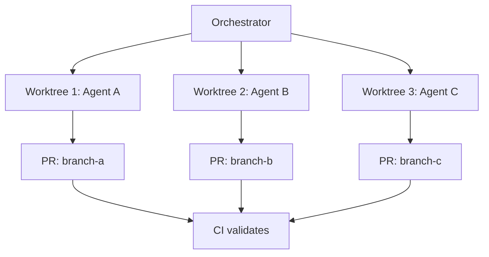

# Worktree Isolation: Parallel Agent Sessions in Safe Sandboxes

> Run each agent in its own git worktree — an isolated repo copy on a separate branch — so agents can't interfere with each other or with the main branch.

!!! note "Also known as"
    Parallel Agent Infrastructure, Multi-Agent Parallelism. For the human experience of managing parallel sessions — role shift, coordination overhead, and decision-making — see [Parallel Agent Sessions](parallel-agent-sessions.md).

## What Worktrees Provide

`git worktree` creates additional working directories linked to the same repository. Each worktree has its own checked-out branch, its own working tree state, and shares git objects with the main checkout — so creation is fast and disk overhead is minimal.

For agent workflows, this means: each agent gets a private sandbox. It reads and writes files without affecting any other agent's environment. If its output is wrong, the worktree is deleted. If its output is correct, its branch is submitted for merge.

[Claude Code's worktrees workflow documentation](https://code.claude.com/docs/en/common-workflows) covers the mechanics. The underlying primitive is standard [git worktree](https://git-scm.com/docs/git-worktree) — nothing Claude-specific about the isolation guarantee.

## Isolation Guarantees

- No shared working directory — agents can't overwrite each other's files
- No interference with the main branch during execution
- Failures are contained — a bad agent output affects only its worktree
- Each agent's changes are captured on a separate branch for review

## Parallelism

Worktrees enable agents to work simultaneously without coordination overhead. An agent refactoring authentication and an agent adding a new feature can run in parallel because they operate in independent directories.

The batch pattern: decompose work into N units, spawn N agents each in its own worktree, each agent opens a PR. CI validates each branch independently.



## Pairing with the Ralph Wiggum Loop

Worktree isolation pairs with the [Ralph Wiggum Loop](../agent-design/ralph-wiggum-loop.md): each iteration can run in a fresh worktree, discarding the environment on failure and starting clean for the next cycle. The disk state that persists between iterations lives outside the worktree — in shared files the orchestrator controls.

## Creating and Managing Worktrees

```bash
# Create a worktree for a new branch
git worktree add ../agent-task-1 -b agent/task-1

# Remove a worktree when done
git worktree remove ../agent-task-1
```

[Claude Code's sub-agent configuration](https://code.claude.com/docs/en/sub-agents) supports `isolation: worktree` that handles this automatically for agents it spawns.

Within an agent conversation, the `EnterWorktree` and `ExitWorktree` tools provide programmatic session management. `ExitWorktree` enables clean teardown — the agent returns to its original working directory rather than requiring session termination to leave a worktree.

## When This Backfires

Worktrees are not always the right tool:

- **Environment re-initialization overhead**: Each worktree is a fresh checkout. Long setup sequences — `npm install`, Docker builds, secrets provisioning — run once per worktree. For short-lived agents doing lightweight tasks, this cost can exceed the parallelism benefit.
- **Disk pressure at scale**: Each worktree duplicates the working tree (not git objects, but all tracked files). Fifty agents on a large monorepo can saturate disk before the first task completes.
- **Orchestrator complexity**: The orchestrator must track which branch lives in which worktree, handle cleanup on failure, and reconcile branches after runs. For simple sequential tasks this is pure overhead.
- **Stateless agents don't need isolation**: If an agent only reads files and calls external APIs — never writes to disk — shared checkout is safe and worktrees add friction without benefit.

## Anti-Pattern: Shared Checkout

Multiple agents writing to the same working directory produce merge conflicts, lost writes, and unpredictable state. The agents can't know what the other has changed, so each operates on a view of the repo that becomes stale as the other writes. Worktrees eliminate this class of problem entirely.

## Example

An orchestrator decomposes a migration into three independent tasks and fans them out to worktree-isolated agents:

```bash
# Orchestrator script: fan out three agents
for task in rename-user-model add-audit-log update-api-docs; do
  git worktree add "../wt-${task}" -b "agent/${task}"
  claude --worktree "../wt-${task}" \
    --prompt "Complete the ${task} task per AGENTS.md" &
done
wait

# Each agent's branch is now ready for PR
for task in rename-user-model add-audit-log update-api-docs; do
  cd "../wt-${task}"
  git push -u origin "agent/${task}"
  cd -
done

# Cleanup
for task in rename-user-model add-audit-log update-api-docs; do
  git worktree remove "../wt-${task}"
done
```

Each agent operates in its own directory. If `add-audit-log` fails, its worktree is deleted without affecting the other two. The orchestrator collects the surviving branches and opens PRs.

## Key Takeaways

- Each agent in its own git worktree cannot interfere with other agents or the main branch.
- Worktrees share git objects — creation is fast, disk overhead is minimal.
- Failed agent outputs cost nothing to discard; successful outputs become branches ready for review.
- The batch pattern (N agents, N worktrees, N PRs) enables natural parallelism across independent tasks.

## Related

- [The Ralph Wiggum Loop](../agent-design/ralph-wiggum-loop.md)
- [Agent Backpressure](../agent-design/agent-backpressure.md)
- [Agent Handoff Protocols](../multi-agent/agent-handoff-protocols.md)
- [Single-Branch Git for Agent Swarms](single-branch-git-agent-swarms.md)
- [Sub-Agents for Fan-Out Research and Context Isolation](../multi-agent/sub-agents-fan-out.md)
