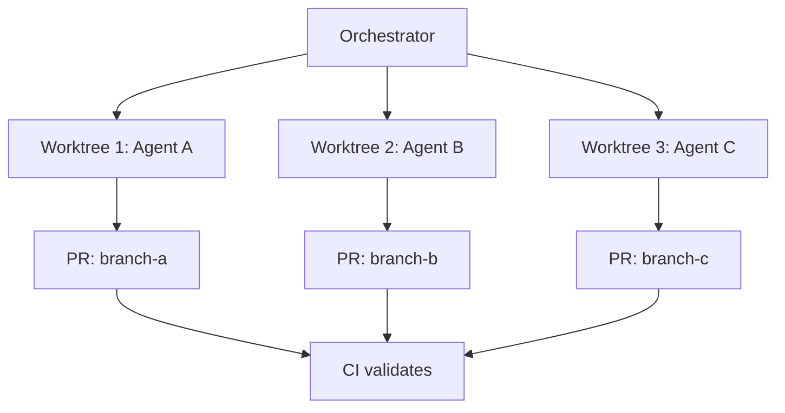

# Worktree Isolation: Parallel Agent Sessions in Safe Sandboxes

> Run each agent in its own git worktree, an isolated repo copy on its own branch, so agents never collide with each other or main.

Learn it hands-on with the [Sandboxes for Swarms guided lesson](https://learn.agentpatterns.ai/workflows/sandboxes-for-swarms/), which includes quizzes.

!!! note "Also known as"
    Parallel Agent Infrastructure, Multi-Agent Parallelism. For the human experience of managing parallel sessions — role shift, coordination overhead, and decision-making — see [Parallel Agent Sessions](parallel-agent-sessions.md).

## What worktrees provide

`git worktree` creates extra working directories linked to the same repository. Each worktree has its own checked-out branch and its own working tree state. Each one also shares git objects with the main checkout, so creation is fast and disk overhead is small.

For agent workflows, this gives each agent a private sandbox. Claude Code sets this up for each sub-agent through `isolation: worktree`. The agent reads and writes files without touching any other agent's environment. If its output is wrong, you delete the worktree. If its output is correct, you submit its branch for merge.

The [Claude Code worktrees workflow documentation](https://code.claude.com/docs/en/common-workflows) covers the mechanics. The underlying primitive is standard [git worktree](https://git-scm.com/docs/git-worktree), so nothing about the isolation guarantee is Claude-specific.

## Isolation guarantees

- No shared working directory, so agents cannot overwrite each other's files
- No interference with the main branch while agents run
- Contained failures, so a bad agent output affects only its worktree
- A separate branch per agent that captures its changes for review

## Parallelism

Worktrees let agents work at the same time without coordination overhead. An agent refactoring authentication and an agent adding a new feature can run in parallel, because they work in separate directories.

The [batch pattern](../tools/claude/batch-worktrees.md) works like this: split work into N units, spawn N agents each in its own worktree, and have each agent open a PR. CI validates each branch on its own.


```mermaid
graph TD
    O[Orchestrator] --> W1[Worktree 1: Agent A]
    O --> W2[Worktree 2: Agent B]
    O --> W3[Worktree 3: Agent C]
    W1 --> PR1[PR: branch-a]
    W2 --> PR2[PR: branch-b]
    W3 --> PR3[PR: branch-c]
    PR1 --> CI[CI validates]
    PR2 --> CI
    PR3 --> CI
```

## Pairing with the Ralph Wiggum Loop

Worktree isolation pairs with the [Ralph Wiggum Loop](../loop-engineering/ralph-wiggum-loop.md). Each iteration can run in a fresh worktree, which discards the environment on failure and starts clean for the next cycle. The disk state that persists between iterations lives outside the worktree, in shared files the orchestrator controls.

## Creating and managing worktrees

```bash
# Create a worktree for a new branch
git worktree add ../agent-task-1 -b agent/task-1

# Remove a worktree when done
git worktree remove ../agent-task-1
```

The [Claude Code sub-agent configuration](https://code.claude.com/docs/en/sub-agents) supports `isolation: worktree`, which handles this automatically for agents it spawns. The [`--worktree` flag](https://code.claude.com/docs/en/common-workflows#run-parallel-claude-code-sessions-with-git-worktrees) creates an isolated worktree for a top-level session. Claude Code removes the worktree on exit if you made no changes.

## When this backfires

Worktrees are not always the right tool:

- Environment re-initialization overhead: each worktree is a fresh checkout. Long setup sequences, such as `npm install`, Docker builds, and secrets provisioning, run once per worktree. For short-lived agents doing lightweight tasks, this cost can exceed the parallelism benefit.
- Disk pressure at scale: each worktree duplicates the working tree (not git objects, but all tracked files). Fifty agents on a large monorepo can fill the disk before the first task completes.
- Orchestrator complexity: the orchestrator must track which branch lives in which worktree, clean up on failure, and reconcile branches after runs. [Lazy worktree isolation](lazy-worktree-isolation.md) defers that overhead until first write. For simple sequential tasks this is pure overhead.
- Stateless agents do not need isolation: if an agent only reads files and calls external APIs, and never writes to disk, a shared checkout is safe and worktrees add friction without benefit.
- Runtime state is not isolated: worktrees separate files and branches but not ports, databases, caches, secrets, or background processes. Two agents running a dev server on port 3000, a shared Postgres instance, or the same Docker daemon will collide even though their checkouts are independent. For runtime isolation, pair worktrees with per-agent containers, ephemeral databases, and dynamic port allocation. See [this discussion of the runtime isolation gap](https://www.penligent.ai/hackinglabs/git-worktrees-need-runtime-isolation-for-parallel-ai-agent-development/).

## Anti-pattern: shared checkout

Multiple agents writing to the same working directory produce merge conflicts, lost writes, and unpredictable state. The agents cannot know what the others changed, so each works from a view of the repo that goes stale as the others write. Worktrees remove this class of problem entirely.

## Example

An orchestrator decomposes a migration into three independent tasks and fans them out to worktree-isolated agents:

```bash
# Orchestrator script: fan out three agents
for task in rename-user-model add-audit-log update-api-docs; do
  git worktree add "../wt-${task}" -b "agent/${task}"
  claude --worktree "../wt-${task}" \
    --prompt "Complete the ${task} task per AGENTS.md" &
done
wait

# Each agent's branch is now ready for PR
for task in rename-user-model add-audit-log update-api-docs; do
  cd "../wt-${task}"
  git push -u origin "agent/${task}"
  cd -
done

# Cleanup
for task in rename-user-model add-audit-log update-api-docs; do
  git worktree remove "../wt-${task}"
done
```

Each agent operates in its own directory. If `add-audit-log` fails, its worktree is deleted without affecting the other two. The orchestrator collects the surviving branches and opens PRs.

## Key Takeaways

- Each agent in its own git worktree cannot interfere with other agents or the main branch.
- Worktrees share git objects — creation is fast, disk overhead is minimal.
- Failed agent outputs cost nothing to discard; successful outputs become branches ready for review.
- The [batch pattern](../tools/claude/batch-worktrees.md) (N agents, N worktrees, N PRs) enables natural parallelism across independent tasks.

## Related

- [The Ralph Wiggum Loop](../loop-engineering/ralph-wiggum-loop.md)
- [Agent Backpressure](../agent-design/agent-backpressure.md)
- [Agent Handoff Protocols](../multi-agent/agent-handoff-protocols.md)
- [Single-Branch Git for Agent Swarms](single-branch-git-agent-swarms.md)
- [Sub-Agents for Fan-Out Research and Context Isolation](../multi-agent/sub-agents-fan-out.md)
- [Sparse Paths Monorepo Isolation](../tools/claude/sparse-paths-monorepo-isolation.md)
- [Lazy Worktree Isolation: Enter the Worktree on First Write, Not on Dispatch](lazy-worktree-isolation.md)
